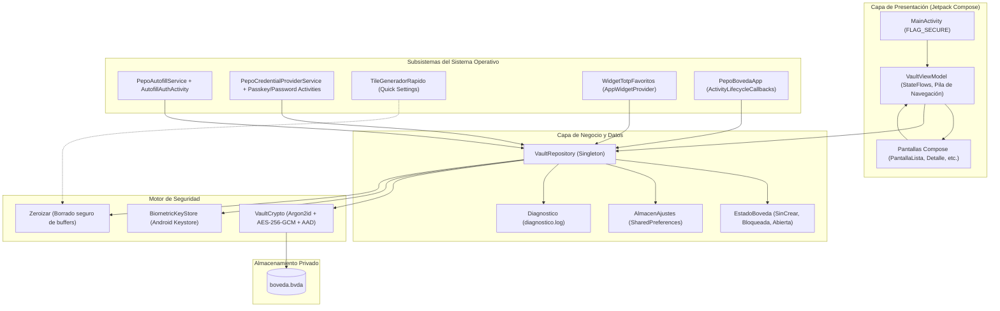

# Arquitectura y Guía de Conexiones de Bóveda Local

Este documento es la **referencia técnica y arquitectónica definitiva** para desarrolladores, colaboradores y **agentes de Inteligencia Artificial** que trabajen en el código de **Bóveda Local**. Describe la arquitectura integral, el flujo de datos unidireccional, las conexiones entre componentes, la navegación, los subsistemas de Android y los invariantes de seguridad no negociables.

---

## Índice

1. [Filosofía y Principios Inquebrantables (Invariantes de Seguridad)](#1-filosofía-y-principios-inquebrantables)
2. [Estructura del Proyecto y Paquetes](#2-estructura-del-proyecto-y-paquetes)
3. [Flujo de Datos y Conexiones Centrales (Data Flow)](#3-flujo-de-datos-y-conexiones-centrales)
4. [Navegación y Gestión de Pantallas](#4-navegación-y-gestión-de-pantallas)
5. [Criptografía, Memoria y Persistencia (`boveda.bvda`)](#5-criptografía-memoria-y-persistencia)
6. [Subsistemas del Sistema Operativo Android](#6-subsistemas-del-sistema-operativo-android)
7. [Motor de UI, Estilos y Normalización Visual](#7-motor-de-ui-estilos-y-normalización-visual)
8. [Lógica de Filtrado, Ordenación y Agrupación Inteligente](#8-lógica-de-filtrado-ordenación-y-agrupación-inteligente)
9. [Ciclo de Vida, Inactividad y Auto-bloqueo](#9-ciclo-de-vida-inactividad-y-auto-bloqueo)
10. [Diagnóstico, Registro y Transparencia](#10-diagnóstico-registro-y-transparencia)
11. [Reglas de Oro para Desarrolladores y Agentes IA](#11-reglas-de-oro-para-desarrolladores-y-agentes-ia)
12. [Comandos Esenciales y Guía de Pruebas](#12-comandos-esenciales-y-guía-de-pruebas)

---

## 1. Filosofía y Principios Inquebrantables

Bóveda Local es un gestor de credenciales offline para Android basado en un modelo de **confianza verificable**. Cada cambio de código debe respetar estrictamente estos 5 principios:

1. **Cero Conectividad (Sin Internet):**
   - El permiso `android.permission.INTERNET` está **terminantemente prohibido**.
   - En el `AndroidManifest.xml` se retiran activamente librerías que intenten inyectar permisos de red o fingerprint legado (`tools:node="remove"`).
   - La aplicación jamás envía telemetría ni realiza conexiones salientes.

2. **Protección Anti-Captura y Anti-Recientes (`FLAG_SECURE`):**
   - Todas las `Activity` (`MainActivity`, `AutofillAuthActivity`, actividades de passkey/credenciales) deben activar de forma **incondicional y permanente** `FLAG_SECURE`.
   - Queda prohibido desactivar `FLAG_SECURE` bajo condicionales o ajustes de usuario.

3. **Zeroización y Limpieza en Memoria:**
   - La contraseña maestra, claves simétricas derivadas, datos planos descifrados y buffers sensibles deben sobrescribirse con ceros inmediatamente tras su uso mediante `Zeroizar.borrar(...)`.
   - Se debe favorecer el uso de `ByteArray` y `CharArray` para secretos en lugar de `String` (los cuales son inmutables y persisten en el heap de la JVM hasta el GC).

4. **Transparencia y Cero Fugas en Logs:**
   - Jamás volcar contraseñas, notas, claves OTP, secretos TOTP o identificadores privados en `android.util.Log` ni en `Diagnostico` / `RegistroEventos`.
   - El archivo de registro `diagnostico.log` solo debe contener eventos técnicos y metadatos de estado.

5. **Concurrencia Segura y Sin ANR:**
   - La derivación KDF (Argon2id) es costosa (~1 segundo). Se ejecuta **siempre fuera** del candado de sincronización de `VaultRepository`.
   - El candado sincronizado solo protege la mutación de estado en memoria y la escritura atómica en disco.

---

## 2. Estructura del Proyecto y Paquetes

El código fuente se organiza bajo el paquete base `com.jlnavas3.bovedalocal`:

```
app/src/main/java/com/jlnavas3/bovedalocal/
├── PepoBovedaApp.kt             # Application class: ciclo de vida global y timeout de inactividad
├── autofill/                    # Framework de Autorrelleno clásico de Android
│   ├── AutofillAuthActivity.kt  # Hoja de desbloqueo biométrico/PIN para autofill
│   ├── AutofillUtiles.kt        # Heurística de detección de campos y paquetes
│   └── PepoAutofillService.kt   # Servicio principal de autofill (AutofillService)
├── camara/                      # Módulos de escaneo QR para 2FA
│   ├── EstadoCamara.kt          # Estados de cámara y resultados de decodificación
│   ├── LectorImagenes.kt        # Lectura de códigos QR desde imágenes del almacenamiento
│   ├── LectorQr.kt              # Decodificador ZXing
│   ├── MotorBase.kt             # Interfaz común de motores de cámara
│   ├── MotorCamaraLegado.kt     # Fallback Camera1 para ROMs antiguas
│   └── MotorCameraX.kt          # Motor moderno CameraX
├── crypto/                      # Motor criptográfico y de seguridad
│   ├── Base32.kt                # Decodificador Base32 para secretos OTP (RFC 3548/4648)
│   ├── BiometricKeyStore.kt     # Envoltorio de claves biométricas en Android Keystore (Fuerte/Compatible)
│   ├── Kdf.kt                   # Parámetros y derivación Argon2id
│   ├── OtpAuth.kt               # Parser de URIs otpauth://totp/
│   ├── PasswordGenerator.kt     # Generador criptográfico (aleatorio, Diceware, patrones)
│   ├── Totp.kt                  # Algoritmo TOTP RFC 6238
│   ├── VaultCrypto.kt           # Cifrado/descifrado AES-256-GCM + AAD
│   ├── Wordlist.kt              # Diccionario español para frases Diceware
│   └── Zeroizar.kt              # Sobrescritura de memoria con ceros
├── data/                        # Modelos, persistencia y estado
│   ├── Ajustes.kt               # Modelo AjustesApp y almacenamiento SharedPreferences (AlmacenAjustes)
│   ├── FrenoIntentos.kt         # Bloqueo temporal por intentos fallidos de desbloqueo
│   ├── ImportadorCsv.kt         # Importador universal (Bitwarden, Google, LastPass, etc.)
│   ├── Modelos.kt               # Entrada, TipoEntrada, CampoPersonalizado, ContenidoBoveda, etc.
│   └── VaultRepository.kt       # Repositorio singleton: acceso a boveda.bvda y control de estado
├── passkey/                     # Credential Manager API (Android 14+ / API 34+)
│   ├── Cbor.kt                  # Parser y serializador CBOR para WebAuthn
│   ├── Origen.kt                # Validación de orígenes web y paquetes Android
│   ├── PasskeyCreateActivity.kt # Registro de llaves de paso (FIDO2 WebAuthn)
│   ├── PasskeyGetActivity.kt    # Autenticación y firma con passkeys
│   ├── PasskeyUi.kt             # Componentes visuales de confirmación de passkey
│   ├── PasswordCreateActivity.kt# Guardado de contraseñas vía Credential Manager
│   ├── PasswordGetActivity.kt   # Selección de contraseñas vía Credential Manager
│   ├── PasswordProviderUtiles.kt# Mapeo y extracción de credenciales
│   ├── PepoCredentialProviderService.kt # Servicio del proveedor de credenciales
│   └── WebAuthn.kt              # Criptografía EC P-256 y autenticadores WebAuthn
├── quicksettings/               # Integración con panel de notificaciones
│   └── TileGeneradorRapido.kt   # TileService para generar contraseñas desde la cortina de Android
├── ui/                          # Capa de presentación (Jetpack Compose)
│   ├── FlujoBiometria.kt        # Orquestador del diálogo biométrico de Android
│   ├── MainActivity.kt          # Actividad principal, Scaffold raíz, inactividad y transiciones
│   ├── VaultViewModel.kt        # ViewModel unificado: estado, navegación con pila y operaciones CRUD
│   ├── componentes/             # Componentes reusables (botones, campos, selector de color, tarjetas)
│   │   ├── IndiceAlfabetico.kt  # Fast-scroller táctil con ola continua Niagara y aceleración GPU
│   ├── pantallas/               # Vistas Compose de cada sección de la app
│   └── theme/                   # Sistema de diseño, paleta de colores y estilos dinámicos
├── util/                        # Utilidades auxiliares
│   ├── AgrupadorSitios.kt       # Lógica de agrupamiento jerárquico por sitio web
│   ├── AjustesSistema.kt        # Accesos directos a ajustes de Android (Autofill, Biometría)
│   ├── Biometria.kt             # Comprobación de capacidades biométricas del dispositivo
│   ├── CambiadorIcono.kt        # Conmutador dinámico de iconos en el launcher
│   ├── ContrasenasComunes.kt    # Lista local de contraseñas débiles conocidas
│   ├── Diagnostico.kt           # Logger interno seguro y exportación técnica
│   ├── Dominios.kt              # Extracción y limpieza de subdominios y dominios registrados
│   ├── Haptica.kt               # Vibración háptica personalizada
│   ├── IconosMarcas.kt          # Catálogo de logotipos locales de marcas conocidas
│   ├── InformeDiagnostico.kt    # Generador de reporte técnico de hardware y ROM
│   ├── MedidorFuerza.kt         # Estimador de entropía zxcvbn local
│   └── Portapapeles.kt          # Copia segura al portapapeles con autodestrucción temporal
└── widget/                      # Widgets de escritorio
    └── WidgetTotpFavoritos.kt   # AppWidgetProvider para códigos TOTP en la pantalla de inicio
```

---

## 3. Flujo de Datos y Conexiones Centrales

Bóveda Local utiliza un patrón de **Flujo Unidireccional de Datos (UDF)** con Jetpack Compose y Kotlin Coroutines StateFlow.

### Diagrama de Conexiones de la Arquitectura



### Mecanismo de Reactividad
1. `VaultRepository` mantiene `_estado: MutableStateFlow<EstadoBoveda>`.
2. `VaultViewModel` expone `estado = repositorio.estado` y `ajustes = repositorio.ajustes.ajustes`.
3. Las pantallas en Compose consumen estos flujos con `collectAsStateWithLifecycle()`.
4. Cualquier modificación en las credenciales (`guardarEntrada`, `eliminarEntrada`, `importarCsv`) actualiza `ContenidoBoveda` dentro de un bloque sincronizado, persiste el archivo `boveda.bvda` y publica el nuevo estado atómicamente.
5. Toda la interfaz de usuario se recompone de manera reactiva e inmediata.

---

## 4. Navegación y Gestión de Pantallas

La navegación no depende de librerías externas complejas (`Navigation Compose` pesado), sino de una estructura ligera y determinista controlada directamente por `VaultViewModel`.

### Estados de Pantalla (`sealed interface Pantalla`)
- `Pantalla.Onboarding`: Bienvenida y creación inicial de contraseña maestra.
- `Pantalla.Desbloqueo`: Ingreso de contraseña maestra o activación biométrica.
- `Pantalla.Lista`: Vista principal con buscador, categorías, ordenación y agrupación.
- `Pantalla.Detalle(id: String)`: Inspección detallada, revelación de credenciales y códigos OTP.
- `Pantalla.Editar(id: String?, contrasenaInicial: String)`: Creación o modificación de credenciales.
- `Pantalla.Generador`: Generador avanzado (longitud, Diceware, patrones personalizados).
- `Pantalla.Passkeys`: Gestión y listado de llaves de paso WebAuthn / FIDO2.
- `Pantalla.Autenticador`: Panel dedicado a códigos 2FA con temporizadores circulares.
- `Pantalla.Escaner(entradaDestino: String?, soloManual: Boolean)`: Escáner QR de doble motor.
- `Pantalla.Ajustes`: Configuración integral del sistema.
- `Pantalla.Tema`, `Pantalla.Formas`, `Pantalla.Tipografia`: Subpantallas de personalización visual.
- `Pantalla.SaludBoveda`: Auditoría de contraseñas repetidas, débiles o sin 2FA.
- `Pantalla.Papelera`: Gestión de entradas eliminadas con auto-depuración a 30 días.
- `Pantalla.Registro`: Visor de eventos técnicos en tiempo real (`Diagnostico`).
- `Pantalla.AcercaDe`: Información de versión y reporte diagnóstico de compatibilidad.

### Pila de Navegación y el Botón "Atrás"
En `VaultViewModel.kt`, la navegación mantiene un historial explícito:
```kotlin
private val pila = ArrayDeque<Pantalla>()

fun ir(pantalla: Pantalla) {
    if (pantalla != _pantalla.value) {
        pila.addLast(_pantalla.value)
        if (pila.size > 20) pila.removeFirst()
    }
    _pantalla.value = pantalla
}

fun retroceder(): Boolean {
    val anterior = pila.removeLastOrNull() ?: return false
    _pantalla.value = anterior
    return true
}

fun volverAtras() {
    if (!retroceder()) irRaiz(Pantalla.Lista)
}
```

#### Regla de Navegación Consistente
- **Pantallas Raíz (`esRaiz`):** `Lista`, `Desbloqueo` y `Onboarding`. En estas pantallas, el gesto atrás del sistema Android sale de la app o minimiza, sin desbordarse dentro de la bóveda bloqueada.
- **Pantallas Hijas:** Deben incluir siempre en su cabecera el componente `BotonVolverAtras` o la flecha estándar (`Icons.AutoMirrored.Filled.ArrowBack`) invocando el callback `onVolver = { vm.volverAtras() }`. Jamás forzar un salto directo a `Pantalla.Lista` si el usuario llegó desde otra subpantalla (por ejemplo, de `Ajustes` a `Tema` y volver a `Ajustes`).

---

## 5. Criptografía, Memoria y Persistencia

### Formato Binario del Archivo `boveda.bvda`
La bóveda se guarda como un único archivo binario en el almacenamiento interno privado (`context.filesDir/boveda.bvda`):

| Offset / Campo | Tamaño | Descripción |
|---|---|---|
| `MAGIC` | 4 bytes | Bytes identificadores `BVDA` (0x42, 0x56, 0x44, 0x41) |
| `VERSION` | 2 bytes | Versión del formato (actualmente 0x0001) |
| `SALT` | 16 bytes | Sal criptográfica aleatoria (`SecureRandom`) generada en cada guardado |
| `ITERACIONES` | 4 bytes | Iteraciones Argon2id (predeterminado: 3) |
| `MEMORIA_KB` | 4 bytes | Memoria KDF en KiB (predeterminado: 65536 KiB = 64 MiB) |
| `PARALELISMO` | 4 bytes | Hilos de ejecución (predeterminado: 4) |
| `NONCE` | 12 bytes | Vector de inicialización aleatorio para AES-256-GCM |
| `PAYLOAD + TAG` | Variable | Texto cifrado con AES-GCM (16 bytes de tag de autenticación al final) |

> **Autenticación de Cabecera (AAD):**
> Toda la cabecera (Magic, Versión, Salt, Parámetros KDF) se pasa como **AAD (Additional Authenticated Data)** al cifrador AES-GCM. Si un atacante modifica los parámetros de la cabecera para rebajar el coste de Argon2, la verificación criptográfica del tag falla inmediatamente impidiendo el descifrado.

### Modos Biométricos (Android Keystore)
1. **Modo Fuerte (`BiometricKeyStore.Modo.FUERTE`):**
   - Utiliza una clave AES-256 generada dentro del hardware seguro (TEE / StrongBox).
   - Configurada con `setUserAuthenticationRequired(true)` y flags de biometría Clase 3 (`AUTH_BIOMETRIC_STRONG`).
   - Se invalida automáticamente ante el registro de nuevas huellas en el SO.
2. **Modo Compatible (`BiometricKeyStore.Modo.COMPATIBLE`):**
   - Diseñado para ROMs modificadas o sensores Clase 2 donde el Keystore produce fallos (e.g. error -26).
   - La clave se almacena protegida en el Keystore pero la validación de la huella/PIN la coordina el sistema operativo antes de liberar la clave.

---

## 6. Subsistemas del Sistema Operativo Android

### 1. Autofill Framework (`PepoAutofillService`)
- Registrado en el manifiesto con `android.permission.BIND_AUTOFILL_SERVICE`.
- `onFillRequest()` inspecciona la jerarquía `AssistStructure` buscando campos `AUTOFILL_HINT_USERNAME`, `AUTOFILL_HINT_PASSWORD`, dominios web o nombres de paquete.
- Si la bóveda está bloqueada, genera una respuesta que abre `AutofillAuthActivity` (con `FLAG_SECURE`) para autenticar con biometría o contraseña sin exponer la app completa.
- `onSaveRequest()` permite capturar y actualizar credenciales directamente desde formularios de inicio de sesión del navegador o apps nativas.

### 2. Credential Manager API (`PepoCredentialProviderService`)
- Implementación de Android 14+ (`androidx.credentials`).
- Provee tanto contraseñas tradicionales como **Passkeys FIDO2/WebAuthn**.
- Emplea `WebAuthn.kt` para generar pares de claves curvas elípticas NIST P-256 (`secp256r1`) y firmar `clientDataJSON` codificando aserciones en CBOR.
- Las actividades auxiliares (`PasskeyGetActivity`, `PasskeyCreateActivity`, `PasswordGetActivity`, `PasswordCreateActivity`) son actividades translúcidas protegidas con `FLAG_SECURE`.

### 3. Quick Settings Tile (`TileGeneradorRapido`)
- Permite a los usuarios generar contraseñas de alta entropía directamente desde el panel de ajustes rápidos de Android.
- Configurable en Ajustes: copia directa al portapapeles, vibración háptica y selección de patrones o longitud.

### 4. AppWidget de Escritorio (`WidgetTotpFavoritos`)
- Widget `RemoteViews` que consulta las entradas marcadas como favoritas con 2FA activo.
- Muestra el código TOTP actual y el tiempo restante de expiración sin exponer las credenciales completas.

---

## 7. Motor de UI, Estilos y Normalización Visual

La aplicación implementa un motor de diseño visual en tiempo real parametrizado a través de `AjustesApp`:

### Tokens de Diseño y Personalización
- **Colores Principales:** `colorAcento` (paleta o hex personalizado), `colorIconosInternos`, `colorTitulos`, `colorTarjetas`.
- **Colores Semánticos por Módulo:**
  - `colorSeguridad`: Botones y tarjetas de seguridad / contraseña maestra.
  - `color2FA`: Módulo de autenticador y TOTP.
  - `colorPasskeys`: Módulo de llaves de paso WebAuthn.
  - `colorGenerador`: Módulo y accesos al generador de contraseñas.
  - `colorSalud`: Diagnóstico y auditoría de la bóveda.
  - `colorPapelera`: Elementos eliminados y acciones destructivas.
  - `colorExportacion`: Respaldos y transferencias.
- **Geometría y Espaciado:** `curvaturaEsquinasDp` (radio de bordes), `grosorBordeDp`, `estiloBorde`, `espaciadoComponentesDp`.
- **Tipografía Dinámica:** `escalaTexto`, `pesoTexto`, `cursivaTexto`, `familiaFuente` (sans, serif, mono, redonda), `espaciadoLetrasSp`, `interlineadoFactor`.
- **Abecedario Lateral (Fast-Scroller Niagara):** `mostrarIndiceAlfabetico`, `indiceEfectoOla`, `indiceAmplitudOlaDp`, `indiceRadioOlaDp`, `indiceEscalaLetras`, `indiceMostrarCirculo`, `indiceOffsetCirculoDp`, `indiceHaptica`, `indiceAnchoTactilDp`.

### Componentes Normalizados (`com.jlnavas3.bovedalocal.ui.componentes.*`)
- `TarjetaConBorde`: Contenedor estándar con borde sutil o marcado, respetando el radio de esquinas global.
- `BotonColorido` / `BotonAmbar` / `BotonBorde`: Botones con altura normalizada de **52 dp**, tipografía centrada de alta legibilidad, soporte para iconos alineados a la izquierda y microinteracciones hápticas.
- `BotonVolverAtras`: Botón de navegación atrás estandarizado con flecha y rótulo accesible.
- `SelectorColorEnTiempoReal`: Diálogo emergente interactivo para seleccionar tonos HSL y previsualizar cambios en vivo.
- `IndiceAlfabetico`: Fast-scroller táctil con curvatura fluida estilo Niagara Launcher:
  - **Matemática de Curvatura Continua ($C^1$):** Calcula la deformación con una función de medio coseno amortiguada:
    $$w(y) = \left(\frac{1 + \cos(\pi \Delta y / R)}{2}\right)^{1.15}$$
    lo que produce una tangencia natural de primera derivada cero al incorporarse a la línea vertical recta.
  - **Escalado Progresivo en GPU:** Acelerado mediante `Modifier.graphicsLayer { scaleX = escala; scaleY = escala; translationX = desplazo; alpha = opacidad }`, ejecutando las transformaciones directamente en el RenderNode de Android a **120 FPS nativos** sin desencadenar recomposiciones de layout ni relayouts.
  - **Captura Gestual de Área Amplia:** El contenedor `Box` define un ancho `anchoZonaTactilDp` (50 dp por defecto, configurable de 26 a 90 dp) y consume el evento inicial (`down.consume()`), permitiendo iniciar el arrastre con máxima comodidad y canal despejado de 36 dp en las tarjetas.
  - **Burbuja Flotante de Cresta:** Diámetro de 78 dp sin bordes, fondo con degradado ámbar, elevación de 14 dp y letra en 38 sp proyectada casi a media pantalla.
- `Animaciones.kt (AnimacionBoveda)`: Motor de renderizado con 4 anillos concéntricos independientes animados mediante reloj de fotogramas por hardware (`withFrameMillis`). Garantiza velocidad angular constante sin tirones ni reinicios periódicos y opera de forma indestructible incluso si las animaciones del sistema operativo se encuentran desactivadas (`animator_duration_scale = 0`).

### Normalización de Pantallas Principales
- **`PantallaDesbloqueo`**: Integración del campo de contraseña con botón de visibilidad embebido (`Icons.Filled.Visibility` / `VisibilityOff`) de 26 dp a la derecha, botón `BotonAmbar` de 52 dp con icono de candado y botón biométrico con lectura de modo Keystore.
- **`PantallaDetalle`**: Ancho horizontal completo para evitar saltos prematuros de línea en nombres de usuario y credenciales extensas; eliminación del `Modifier.blur` inseguro y reemplazo por enmascaramiento con puntos sólidos grandes (`•`); barra de acciones inferior dedicada con contador de caracteres y botón de favoritos reactivo.
- **`PantallaEdicion`**: Botón de generación normalizado a 52 dp en división 50/50 junto a selector desplegable de modos (Aleatoria, Diceware, Patrón) sin navegación externa; selector de tipo de credencial en dropdown protegido contra cambios destructivos en entradas existentes; unificación del medidor de entropía y tiempo de ataque de fuerza bruta con la pantalla del generador.

---

## 8. Lógica de Filtrado, Ordenación y Agrupación Inteligente

### Agrupación por Sitio (`AgrupadorSitios.kt` y `Dominios.kt`)
Cuando un usuario tiene múltiples cuentas para el mismo servicio (ej. cuentas personales y de trabajo en Google, o cuentas en subdominios de Xiaomi), el agrupador las organiza bajo un contenedor desplegable.

- **Diferenciación de Subdominios:**
  La función `Dominios.sitioAgrupacion(url)` extrae la identidad del sitio eliminando esquemas (`https://`), `www.` y el sufijo público (`.com`, `.es`, `.co.uk`), pero **preservando los subdominios distintivos**:
  - `account.xiaomi.com` → `account.xiaomi`
  - `xiaomi.com` → `xiaomi`
  - `aws.amazon.com` → `aws.amazon`
- **Conmutador de Agrupación:**
  Controlado por el ajuste `ajustes.agruparPorSitio`. Si está desactivado (`false`), la lista se presenta plana (`ItemAgrupado.Suelto`) sin jerarquías.
- **Ordenación Visual Coherente:**
  La lista visual (`List<ItemAgrupado>`) se ordena utilizando la etiqueta visible de cada elemento contenedor (`Grupo` o `Suelto`). Esto garantiza que los grupos se integren de forma natural en el orden alfabético estricto (por ejemplo, el grupo `account.xiaomi` bajo la letra **A**, y el grupo `xiaomi` bajo la **X**).

### Criterios de Ordenación (`CriterioOrdenacion`)
1. `NOMBRE_AZ`: Orden alfabético A-Z (con favoritos fijados arriba).
2. `NOMBRE_ZA`: Orden alfabético inverso Z-A.
3. `MODIFICACION_RECIENTE`: Últimas credenciales modificadas primero.
4. `CREACION_RECIENTE`: Nuevas credenciales añadidas primero.
5. `ANTIGUEDAD`: Credenciales más antiguas primero.

---

## 9. Ciclo de Vida, Inactividad y Auto-bloqueo

### Gestión Global en `PepoBovedaApp.kt`
- Implementa `Application.ActivityLifecycleCallbacks` para rastrear las actividades en primer plano (`actividadesVisibles`).
- Cuando `actividadesVisibles == 0`, se registra el timestamp `momentoAlFondo = System.currentTimeMillis()`.
- Al reabrir cualquier actividad, si el tiempo transcurrido supera `ajustes.autoBloqueoSegundos`, se invoca inmediatamente `repositorio.bloquear()`.

### Excepción para Selectores del Sistema (`salidaPendiente`)
Al abrir selectores externos (como SAF para exportar/importar o galería para leer un QR), la app pasa momentáneamente a segundo plano:
```kotlin
PepoBovedaApp.salidaPendiente(context)  // Activa gracia temporal de 2 minutos
try {
    lanzador.launch(...)
} finally {
    PepoBovedaApp.salidaTerminada(context) // Restaura el temporizador estándar
}
```

### Temporizador de Inactividad en Pantalla
En `MainActivity.kt`, los eventos táctiles se capturan mediante `Modifier.pointerInput` en el Scaffold raíz, llamando a `vm.registrarInteraccion()`. Si el usuario no interactúa con la pantalla durante el tiempo límite, `VaultViewModel.vigilarInactividad()` fuerza el bloqueo automático.

---

## 10. Diagnóstico, Registro y Transparencia

- **Ubicación:** `context.filesDir/diagnostico.log`.
- **Estructura:** Fecha ISO 8601, categoría técnica y mensaje descriptivo.
- **Rotación:** Tamaño limitado a 512 KiB con auto-purgado circular para evitar consumo de disco.
- **Visualización:** Disponible en la app en `Ajustes > Transparencia > Registro del sistema` (`PantallaRegistro.kt`).
- **Exportación Técnica:** Permite compartir el archivo de log para soporte sin revelar credenciales.

---

## 11. Reglas de Oro para Desarrolladores y Agentes IA

Cuando implementes nuevas características o corrijas errores, cumple con esta lista de verificación:

1. **[PROHIBIDO] No tocar permisos de red:** Jamás añadir `INTERNET` a `AndroidManifest.xml`.
2. **[OBLIGATORIO] Mantener `FLAG_SECURE`:** Nunca retirar `FLAG_SECURE` de `MainActivity` ni de las actividades de Autofill/Credenciales.
3. **[OBLIGATORIO] Cuidar `remember` en Compose:** Al recordar listas ordenadas o filtradas en componentes Composable, **declarar siempre las dependencias del cálculo** (e.g. `remember(entradas, filtro, criterioOrdenacion, agruparPorSitio)`). Omitir una dependencia causa fallos de actualización visual.
4. **[OBLIGATORIO] Usar `vm.volverAtras()`:** Para botones de retorno en pantallas secundarias, invocar siempre `vm.volverAtras()`. No reinicializar pantallas saltando arbitrariamente a `Pantalla.Lista`.
5. **[OBLIGATORIO] Zeroizar secretos:** Cada vez que utilices un `ByteArray` o `CharArray` para contraseñas, sal, nonce o claves AES, llama a `Zeroizar.borrar(...)` en un bloque `finally`.
6. **[OBLIGATORIO] No bloquear hilos con Argon2:** La función `VaultCrypto.derivarClave(...)` debe correr en `Dispatchers.Default` o `Dispatchers.IO`, nunca bajo sincronizaciones que puedan retrasar el hilo principal.
7. **[OBLIGATORIO] Ejecutar pruebas unitarias:** Antes de dar por finalizada una tarea, verificar que `./gradlew testDebugUnitTest` pase al 100% (140 tests unitarios automatizados).

---

## 12. Comandos Esenciales y Guía de Pruebas

### Compilación y Construcción
```bash
# Compilar versión de depuración (Debug APK)
./gradlew assembleDebug

# Compilar versión final firmada (Release APK)
./gradlew assembleRelease
```

### Gestión de Versiones Automática
El proyecto gestiona su versionado semántico de forma dinámica mediante `version.properties` y el conteo acumulativo de commits Git:
- **`versionName`**: derivado de `major.minor.patch` (ej. `1.0.1`).
- **`versionCode`**: calculado estrictamente como `major * 100000 + minor * 10000 + patch * 1000 + commits` (ej. `100030`), garantizando incrementos numéricos automáticos con cada cambio.

```bash
# Ver versión actual detallada
./gradlew mostrarVersion

# Incrementar parche (ej. 1.0.0 -> 1.0.1)
./gradlew bumpPatch

# Incrementar versión menor (ej. 1.0.0 -> 1.1.0)
./gradlew bumpMinor

# Incrementar versión mayor (ej. 1.0.0 -> 2.0.0)
./gradlew bumpMajor
```


### Ejecución de Pruebas Automatizadas
La suite cuenta con cobertura exhaustiva de lógica de negocio, criptografía, dominios, modelos, filtros y navegación alfabética (140 tests unitarios verificados al 100%):
```bash
# Ejecutar todas las pruebas unitarias de JVM
./gradlew testDebugUnitTest

# Ejecutar una prueba específica (ej. AgrupadorSitiosTest)
./gradlew testDebugUnitTest --tests "com.jlnavas3.bovedalocal.AgrupadorSitiosTest"
```

### Instalación y Verificación en Dispositivo Físico
```bash
# Listar dispositivos conectados
adb devices

# Instalar APK Release en el dispositivo conectado
adb install -r app/build/outputs/apk/release/app-release.apk

# Inspeccionar logs de diagnóstico en tiempo real
adb logcat -s PepoBoveda:D
```
