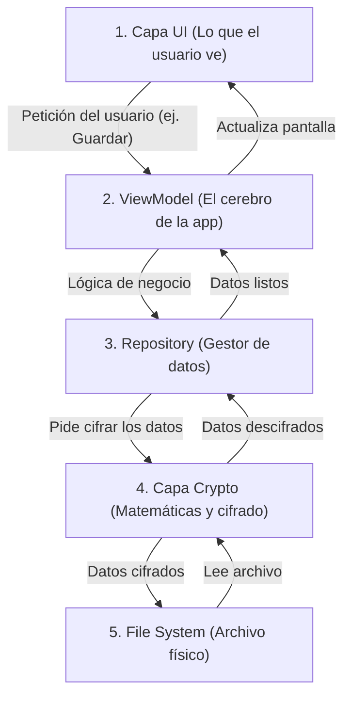
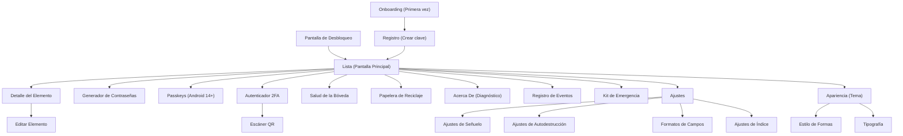
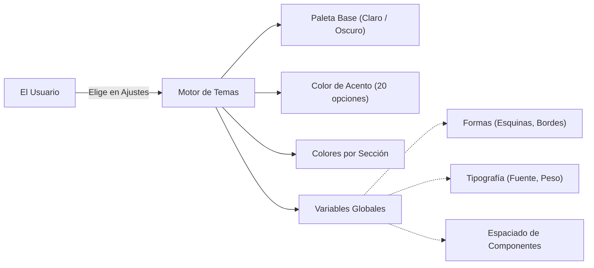
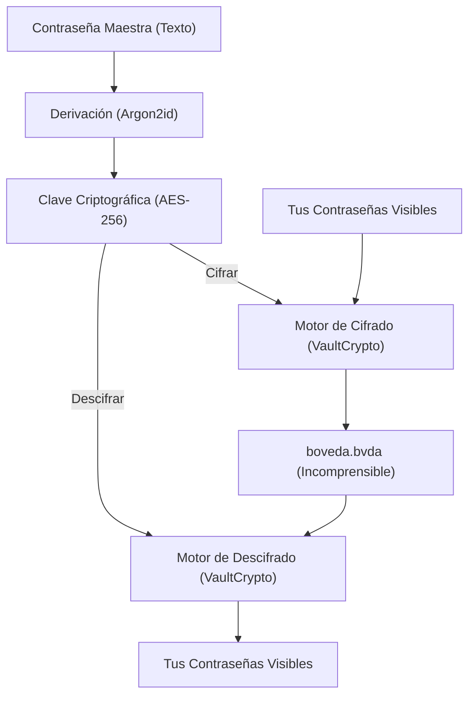
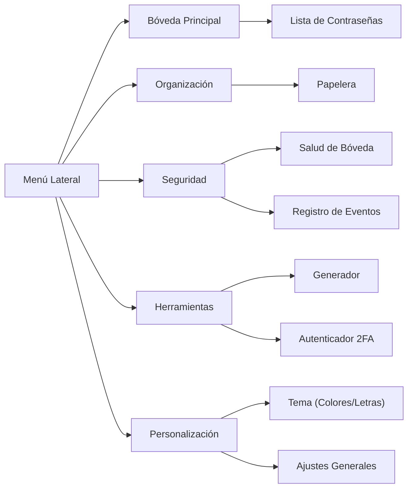
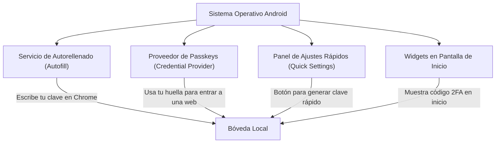
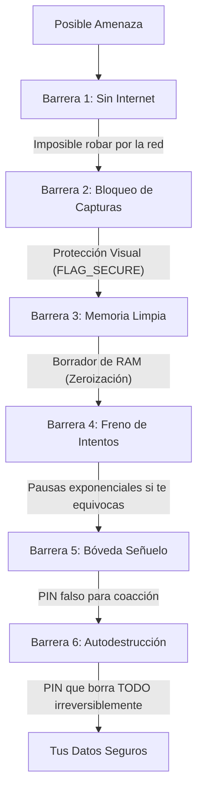
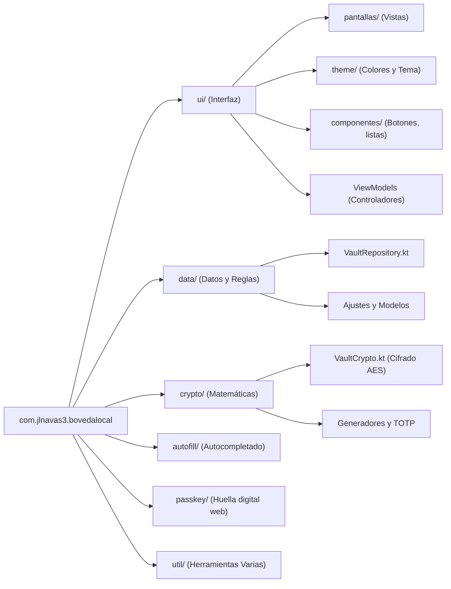

# Arquitectura de Bóveda Local

¡Bienvenido a la documentación arquitectónica de **Bóveda Local**! 

Este documento está diseñado especialmente para programadores principiantes o desarrolladores que acaban de llegar al proyecto. Si no tienes mucha experiencia previa con Android, criptografía o arquitecturas complejas de software, no te preocupes: aquí explicaremos cada parte paso a paso y de la forma más sencilla posible.

---

## Tabla de Contenidos

1. [Arquitectura General](#1-arquitectura-general)
2. [Navegación](#2-navegación)
3. [Temas y Colores](#3-temas-y-colores)
4. [Flujo de Datos Criptográficos](#4-flujo-de-datos-criptográficos)
5. [Secciones del Menú Lateral](#5-secciones-del-menú-lateral)
6. [Servicios de Android](#6-servicios-de-android)
7. [Sistema de Seguridad](#7-sistema-de-seguridad)
8. [Estructura de Paquetes](#8-estructura-de-paquetes)

---

## 1. Arquitectura General

En el desarrollo de software, la "arquitectura" es la forma en la que organizamos el código para que sea fácil de mantener y entender. Bóveda Local utiliza un patrón llamado **MVVM (Model-View-ViewModel)** pero adaptado para ser más sencillo y tener 5 capas principales. 

El objetivo es que los datos fluyan en una sola dirección: el usuario toca un botón, la orden baja capa por capa hasta llegar al archivo guardado, y luego el resultado sube capa por capa hasta mostrarse en la pantalla.

> [!NOTE]
> Separar el código en capas evita tener archivos gigantescos donde se mezcla el diseño visual (UI) con cálculos matemáticos complejos (Crypto). Cada capa tiene una única responsabilidad.

### Explicación paso a paso:
1. **Capa UI (Pantallas Composable)**: Es la interfaz de usuario. Todo lo que el usuario ve y toca (botones, listas, textos). Está construida con Jetpack Compose.
2. **ViewModel (`VaultViewModel`)**: Es el coordinador. Guarda temporalmente la información que se muestra en pantalla y reacciona a los botones que presiona el usuario.
3. **Repository (`VaultRepository`)**: Es el encargado de saber de dónde sacar los datos o dónde guardarlos. Orquesta el proceso de cifrar (proteger) y descifrar (revelar) la información.
4. **Capa Crypto**: Aquí reside la criptografía pura. Son fórmulas matemáticas que convierten tu texto legible en un revoltijo de letras incomprensible (y viceversa).
5. **File System**: Es el almacenamiento del teléfono. Todos los datos se guardan en un único archivo llamado `boveda.bvda`.

---

## 2. Navegación

La navegación es la forma en la que el usuario cambia de una pantalla a otra. En lugar de usar la herramienta por defecto de Android (Jetpack Navigation), Bóveda Local usa un sistema manual y simplificado. 

Imagina la navegación como una pila de cartas: la carta que ves arriba es tu pantalla actual. Si abres una nueva pantalla, pones una carta encima. Si le das al botón de "atrás", quitas la carta de arriba.

> [!TIP]
> Este enfoque manual (usando una estructura de datos llamada `ArrayDeque`) hace que las animaciones de transición sean más fluidas y el código más fácil de seguir.

### Explicación paso a paso:
1. Al abrir la app por primera vez, el usuario ve el **Onboarding** y luego va a **Registro** para crear su contraseña maestra, llegando a la **Lista** principal.
2. Si la app ya estaba configurada, el usuario entra por **Desbloqueo** y llega a la **Lista**.
3. Desde la **Lista** principal, el usuario puede abrir los detalles de una contraseña (**Detalle**) y luego editarla (**Editar**).
4. También puede acceder a herramientas directamente desde la lista: el **Generador** de contraseñas, el **Autenticador** (que incluye un escáner de códigos QR) y utilidades de seguridad como **Salud**, **Papelera**, etc.
5. Finalmente, hay ramas de configuración profunda, como la zona de **Ajustes** y la zona de **Tema** (para cambiar colores y formas).

---

## 3. Temas y Colores

La app permite un alto nivel de personalización visual. No solo tiene el clásico "modo claro" y "modo oscuro", sino que permite cambiar los colores de los botones, las formas de las tarjetas y hasta el tipo de letra.

> [!NOTE]
> Todo esto se maneja mediante variables en memoria (Snapshots de Compose). Cuando el usuario cambia un color, la interfaz se repinta instantáneamente.

### Explicación paso a paso:
1. El usuario interactúa con la pantalla de personalización.
2. El sistema aplica una **Paleta Base**: determina si el fondo es negro u oscuro (Obsidiana) o claro (Blanco/Grisáceo).
3. Luego, se aplica el **Color de Acento**, que es el color principal de botones y detalles. Hay 20 para elegir, como Ámbar (por defecto), Menta, Azul, etc.
4. Los **Colores Semánticos** son colores especiales para zonas de la app (ej. rojo para la Papelera, verde para Salud). El usuario puede personalizarlos.
5. Por último, se aplican variables de forma (si los botones son redondos o cuadrados) y tipografía (el tipo de letra).

---

## 4. Flujo de Datos Criptográficos

Esta es la parte más crítica de un gestor de contraseñas: cómo asegurarnos de que la contraseña que el usuario escribe sirva para proteger o revelar sus datos de manera segura.

> [!CAUTION]
> Para garantizar la máxima seguridad, una contraseña nunca se guarda en texto claro. En su lugar, se "transforma" y se usa de llave. Luego de usarla, se borra de la memoria RAM del teléfono inmediatamente (proceso llamado "Zeroización").

### Explicación paso a paso:
1. El usuario escribe su **Contraseña Maestra**.
2. Esta contraseña pasa por un proceso llamado derivación (`Kdf` usando un algoritmo llamado Argon2id). Esto es como tomar un trozo de metal y tallarlo repetidamente hasta que toma la forma de una llave perfecta y segura.
3. El resultado es una **Clave Criptográfica** matemática súper compleja.
4. Cuando queremos guardar información, pasamos los datos legibles y esta Clave al Motor de **Cifrado**. El resultado se guarda en el archivo físico.
5. Cuando queremos leer información, tomamos el archivo y la Clave y los pasamos al Motor de **Descifrado**, obteniendo los datos legibles para mostrar en pantalla.

---

## 5. Secciones del Menú Lateral

El Menú Lateral es la vía de acceso rápido a las distintas secciones de la aplicación. Agrupa las funcionalidades lógicamente para que el usuario no se pierda.

### Explicación paso a paso:
1. El **Menú Lateral** se abre deslizando desde la izquierda en la pantalla principal.
2. Contiene categorías grandes. La **Bóveda Principal** te lleva directo a tu lista de claves.
3. La zona de **Organización** alberga la papelera, donde van los elementos borrados antes de eliminarse para siempre.
4. En **Seguridad**, encuentras herramientas de diagnóstico que revisan si tus contraseñas son débiles (Salud) y un registro de qué ha pasado en la app.
5. En **Herramientas**, tienes utilidades independientes como crear claves nuevas al azar (Generador) y leer códigos QR para doble factor (Autenticador).
6. **Personalización** contiene todo lo referente a cambiar cómo se ve y cómo se comporta la aplicación.

---

## 6. Servicios de Android

Una app no vive aislada en tu teléfono; interactúa con el sistema operativo Android para hacer la vida del usuario más fácil (por ejemplo, autocompletando contraseñas en el navegador web). A esto le llamamos "Servicios".

> [!IMPORTANT]
> Estos componentes requieren configuraciones especiales en el archivo `AndroidManifest.xml` del proyecto para que Android sepa que existen y los pueda llamar cuando se necesiten.

### Explicación paso a paso:
1. El **Autofill (Autorellenado)** es lo que permite que un mensajito aparezca cuando estás en otra app (ej: Instagram) sugiriendo tu contraseña guardada en Bóveda Local.
2. El **Credential Provider** es exclusivo de Android 14+ y maneja "Passkeys" (inicios de sesión sin contraseña que usan la huella del teléfono directamente para autenticar webs y apps).
3. El **Panel de Ajustes Rápidos** (Quick Settings) permite añadir un botón en la cortina de notificaciones de Android para abrir rápidamente el Generador de contraseñas.
4. Los **Widgets** permiten al usuario colocar en su escritorio del celular códigos temporales de seguridad (TOTP) para verlos sin tener que abrir la app.

---

## 7. Sistema de Seguridad

La seguridad no se basa en una sola barrera, sino en múltiples capas. Si un atacante burla una, se encontrará con la siguiente. Es como un castillo con foso, murallas gruesas y guardias.

> [!WARNING]
> La bóveda NUNCA se conecta a internet. No solicitamos permisos de red, lo que garantiza que ninguna información puede salir de tu dispositivo por sí sola.

### Explicación paso a paso:
1. **Sin Internet**: La app está "aislada" del mundo. Incluso si el teléfono tiene un virus que intenta enviar datos de la app por internet, la app misma no tiene capacidad de hablar con servidores.
2. **Bloqueo de Capturas (FLAG_SECURE)**: Impide tomar "screenshots" (capturas de pantalla) y oscurece la app en la vista de aplicaciones recientes.
3. **Memoria Limpia**: Las contraseñas en texto claro se eliminan de la memoria RAM apenas milisegundos después de ser usadas.
4. **Freno de Intentos**: Si alguien intenta adivinar tu contraseña maestra fallando muchas veces seguidas, la app empieza a hacerle esperar (5 segundos, luego 30, luego 2 minutos...), frenando ataques de "fuerza bruta".
5. **Bóveda Señuelo**: Si alguien te obliga bajo amenaza física a abrir la app, puedes poner una contraseña "falsa" que abre una bóveda inventada (vacía o con datos irrelevantes).
6. **Autodestrucción**: Puedes configurar un PIN especial que, al ingresarse, borra todo rastro de tu bóveda real de manera permanente.

---

## 8. Estructura de Paquetes

Finalmente, veamos cómo están organizados físicamente los archivos dentro del código fuente. Conocer esto te dirá exactamente a qué carpeta ir cuando necesites cambiar algo.

### Explicación paso a paso:
1. La carpeta raíz es `com.jlnavas3.bovedalocal`. Todo el código vive aquí.
2. La carpeta **`ui/`** contiene todo lo visual. Aquí encontrarás las pantallas principales, el código del diseño (`theme/`), y botones reciclables (`componentes/`). También contiene los ViewModels que controlan las pantallas.
3. La carpeta **`data/`** contiene los modelos de información (las "cajas" que guardan tus datos en la app, como el archivo `Modelos.kt`), la gestión de ajustes de la app y el `VaultRepository`, que orquesta el guardado.
4. La carpeta **`crypto/`** contiene algoritmos complejos de matemáticas, generación segura y gestión de códigos 2FA. Es la caja fuerte matemática de la app.
5. Las carpetas **`autofill/`** y **`passkey/`** manejan exclusivamente la comunicación entre la app y el sistema Android para autorellenar campos o iniciar sesión en otras apps.
6. La carpeta **`util/`** tiene funciones de ayuda genéricas: manejo del portapapeles de Android, vibración del celular, etc.

---

¡Eso es todo! Con esta guía deberías tener un panorama muy claro de cómo funciona **Bóveda Local** por dentro, desde qué pasa cuando tocas un botón hasta cómo se protegen los datos contra ataques.
