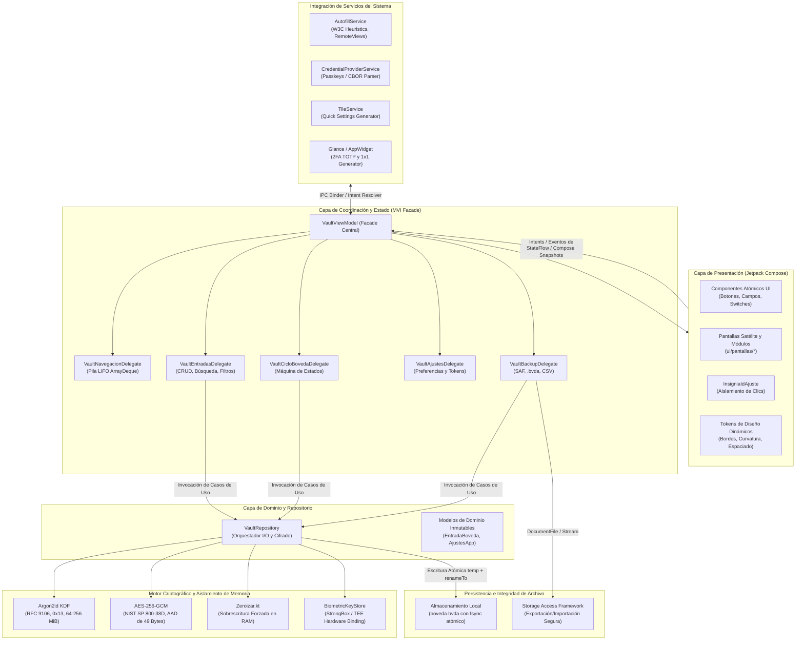
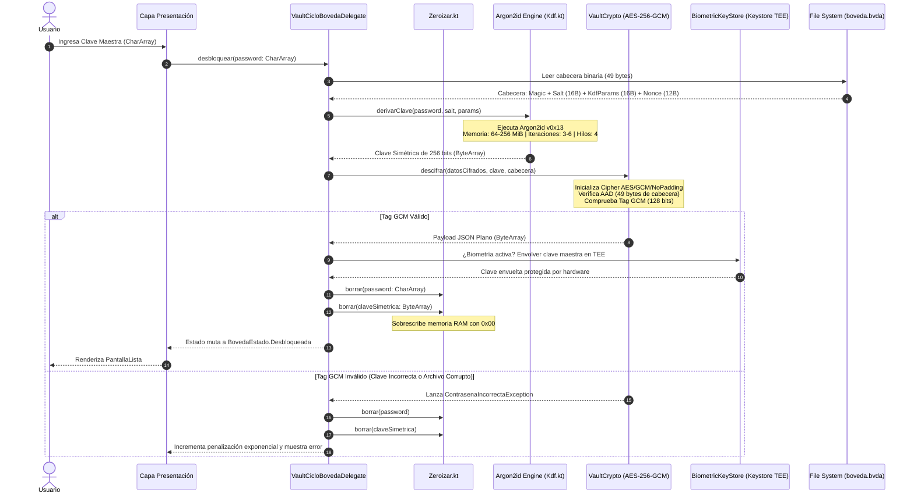
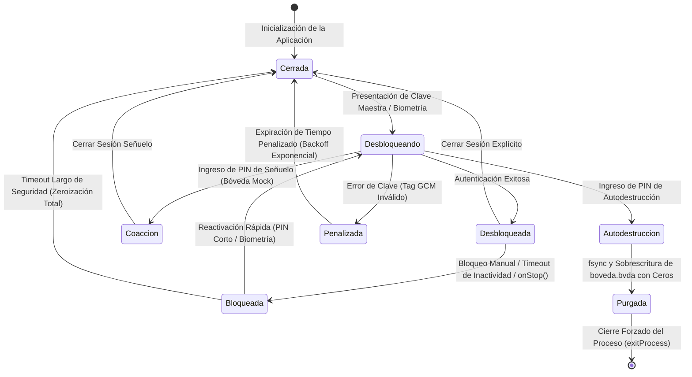
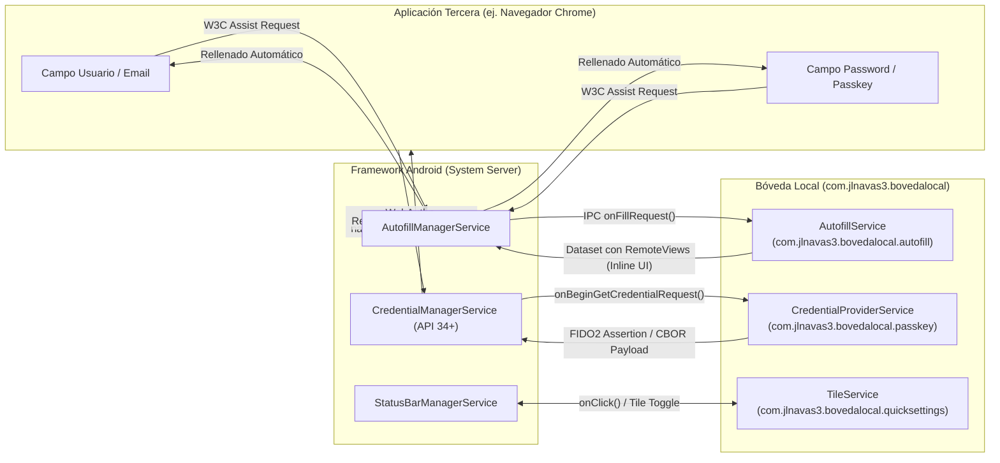
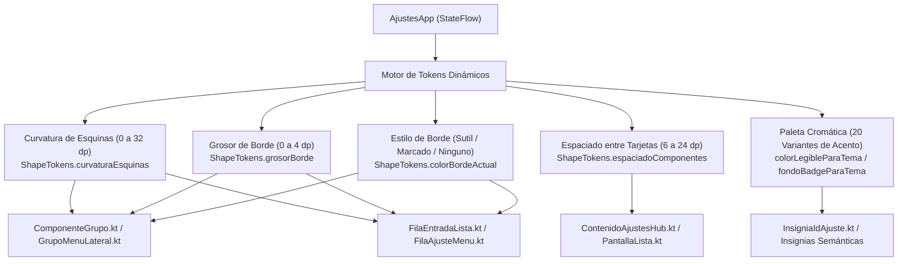

# Arquitectura Técnica de Bóveda Local

## Especificación Formal de Ingeniería y Seguridad Criptográfica

**Bóveda Local** (`com.jlnavas3.bovedalocal`) es una plataforma offline de gestión de credenciales, autenticación de dos factores (TOTP RFC 6238) y proveedor de llaves de acceso (Passkeys / WebAuthn FIDO2) para el sistema operativo Android. La aplicación opera bajo una arquitectura de **Confianza Cero en Red (Zero-Network Architecture)**: el manifiesto de la aplicación carece de forma estricta y absoluta del permiso `android.permission.INTERNET`, haciendo físicamente imposible cualquier exfiltración telemática de datos desde el espacio de usuario.

Este documento detalla la topología de diseño, la orquestación reactiva del estado, la máquina criptográfica formal, los contratos inter-proceso (IPC) con el framework de Android y el estándar de modularización limpia adoptado en el código fuente.

---

## 1. Topología Arquitectónica y Principios de Diseño

El sistema implementa una variante estricta de **Clean Architecture** combinada con **MVI/MVVM (Model-View-Intent / Model-View-ViewModel)** y **Flujo Unidireccional de Datos (UDF - Unidirectional Data Flow)** sobre Jetpack Compose.


```mermaid
flowchart TD
    subgraph UI_Presentation ["Capa de Presentación (Jetpack Compose)"]
        Atoms["Componentes Atómicos UI<br/>(Botones, Campos, Switches)"]
        Organisms["Pantallas Satélite y Módulos<br/>(ui/pantallas/*)"]
        Badges["InsigniaIdAjuste<br/>(Aislamiento de Clics)"]
        Tokens["Tokens de Diseño Dinámicos<br/>(Bordes, Curvatura, Espaciado)"]
    end

    subgraph State_Coordination ["Capa de Coordinación y Estado (MVI Facade)"]
        VM["VaultViewModel (Facade Central)"]
        DelNav["VaultNavegacionDelegate<br/>(Pila LIFO ArrayDeque)"]
        DelEnt["VaultEntradasDelegate<br/>(CRUD, Búsqueda, Filtros)"]
        DelCic["VaultCicloBovedaDelegate<br/>(Máquina de Estados)"]
        DelAju["VaultAjustesDelegate<br/>(Preferencias y Tokens)"]
        DelBkp["VaultBackupDelegate<br/>(SAF, .bvda, CSV)"]
    end

    subgraph Domain_Repo ["Capa de Dominio y Repositorio"]
        Repo["VaultRepository<br/>(Orquestador I/O y Cifrado)"]
        Models["Modelos de Dominio Inmutables<br/>(EntradaBoveda, AjustesApp)"]
    end

    subgraph Crypto_Engine ["Motor Criptográfico y Aislamiento de Memoria"]
        KDF["Argon2id KDF<br/>(RFC 9106, 0x13, 64-256 MiB)"]
        AES["AES-256-GCM<br/>(NIST SP 800-38D, AAD de 49 Bytes)"]
        Zero["Zeroizar.kt<br/>(Sobrescritura Forzada en RAM)"]
        Keystore["BiometricKeyStore<br/>(StrongBox / TEE Hardware Binding)"]
    end

    subgraph Persistence ["Persistencia e Integridad de Archivo"]
        FS["Almacenamiento Local<br/>(boveda.bvda con fsync atómico)"]
        SAF["Storage Access Framework<br/>(Exportación/Importación Segura)"]
    end

    subgraph Android_System ["Integración de Servicios del Sistema"]
        Autofill["AutofillService<br/>(W3C Heuristics, RemoteViews)"]
        CredMan["CredentialProviderService<br/>(Passkeys / CBOR Parser)"]
        Tile["TileService<br/>(Quick Settings Generator)"]
        Widget["Glance / AppWidget<br/>(2FA TOTP y 1x1 Generator)"]
    end

    %% Relaciones
    UI_Presentation -->|"Intents / Eventos de Usuario"| VM
    VM --> DelNav & DelEnt & DelCic & DelAju & DelBkp
    DelEnt & DelCic & DelBkp -->|"Invocación de Casos de Uso"| Repo
    Repo --> KDF & AES & Zero & Keystore
    Repo -->|"Escritura Atómica temp + renameTo"| FS
    DelBkp -->|"DocumentFile / Stream"| SAF
    VM -->|"StateFlow / Compose Snapshots"| UI_Presentation
    Android_System <-->|"IPC Binder / Intent Resolver"| VM
```

### Principios Fundamentales
1. **Separación de Responsabilidades Unidireccional (UDF):** Los componentes de interfaz de usuario emiten eventos e intenciones de forma ascendente. Los delegados procesan la lógica de negocio y emiten instantáneas inmutables de estado (`StateFlow`) hacia abajo.
2. **Erradicación de God-Files (Modularidad Atómica):** Ningún archivo de interfaz supera las responsabilidades unitarias de su contexto. Los antiguos monolitos (`Componentes.kt`, `Animaciones.kt`, `Contenedores.kt`, `BarraFiltrosYBusqueda.kt`) fueron descompuestos en submódulos especializados dentro de `com.jlnavas3.bovedalocal.ui`.
3. **Inmutabilidad de Datos en Tránsito:** Las estructuras de datos del dominio (`EntradaBoveda`, `AjustesApp`, `MetadatosBoveda`) son `data class` inmutables. Toda modificación genera una nueva instancia, facilitando la detección de cambios en el compilador de Jetpack Compose.
4. **Tolerancia Cero a Strings en Material Sensible:** Las contraseñas maestras y claves criptográficas efímeras se procesan exclusivamente en buffers primitivos (`CharArray`, `ByteArray`), permitiendo su destrucción inmediata en memoria RAM mediante rutinas de zeroización sin depender del recolector de basura (GC).

---

## 2. Orquestación del Estado: Patrón Facade y Delegados Reactivos

Para evitar la sobrecarga del controlador central (`VaultViewModel`), se implementó el patrón **Facade con Composición de Delegados**. El ViewModel central actúa como un punto de enlace liviano (~200 líneas) que expone el estado global e intercomunica cinco delegados de dominio especializados:

| Delegado | Archivo | Responsabilidad Arquitectónica |
| :--- | :--- | :--- |
| **`VaultNavegacionDelegate`** | [`VaultViewModelNavegacion.kt`](file:///home/jln/BovedaLocal/app/src/main/java/com/jlnavas3/bovedalocal/ui/VaultViewModelNavegacion.kt) | Gestiona la pila de navegación LIFO en memoria (`ArrayDeque<Pantalla>`), resolución de ancestros `padreDe()` y enrutamiento O(1) mediante identificadores canónicos `irPorId()`. |
| **`VaultEntradasDelegate`** | [`VaultViewModelEntradas.kt`](file:///home/jln/BovedaLocal/app/src/main/java/com/jlnavas3/bovedalocal/ui/VaultViewModelEntradas.kt) | Ciclo de vida CRUD de credenciales (`EntradaBoveda`), ordenación multi-criterio, motor de búsqueda fonética/normalizada, gestión de etiquetas y papelera con retención temporal. |
| **`VaultCicloBovedaDelegate`** | [`VaultViewModelCicloBoveda.kt`](file:///home/jln/BovedaLocal/app/src/main/java/com/jlnavas3/bovedalocal/ui/VaultViewModelCicloBoveda.kt) | Máquina de estados de la bóveda (cerrada, desbloqueada, coacción/señuelo, autodestrucción), penalización temporal exponencial anti-fuerza bruta y temporizador de bloqueo por inactividad. |
| **`VaultAjustesDelegate`** | [`VaultViewModelAjustes.kt`](file:///home/jln/BovedaLocal/app/src/main/java/com/jlnavas3/bovedalocal/ui/VaultViewModelAjustes.kt) | Mutación reactiva y persistencia atómica de la entidad `AjustesApp`. Propagación en tiempo real de tokens de diseño (espaciado, grosor, curvatura, paleta de colores). |
| **`VaultBackupDelegate`** | [`VaultViewModelBackup.kt`](file:///home/jln/BovedaLocal/app/src/main/java/com/jlnavas3/bovedalocal/ui/VaultViewModelBackup.kt) | Orquestación de copias de seguridad automáticas y manuales mediante SAF (`Storage Access Framework`), exportación selectiva cifrada e importación estructurada de bases de datos externas / CSV. |

---

## 3. Estándar Global de Identificadores Jerárquicos Tri-Grama

La aplicación implementa una taxonomía de identificación jerárquica canónica basada en **Tri-Gramas con separación por guiones**, normalizando la navegación, la persistencia de colores de bloque y las auditorías de seguridad:

$$\text{ID Canónico} = \mathbf{XX}\text{-}\mathbf{YYY}[\text{-}\mathbf{ZZZ}[\text{-}\mathbf{Gnn}]]$$

Donde:
* $\mathbf{XX}$: Bloque funcional primario de dos dígitos (`00` a `06`).
* $\mathbf{YYY}$: Identificador nemotécnico de 3 caracteres del subsistema (ej. `SEG`, `APA`, `LST`).
* $\mathbf{ZZZ}$: Código de 3 caracteres del módulo satélite o pantalla dedicada (ej. `BIO`, `GEO`, `AZX`).
* $\mathbf{Gnn}$: Código de agrupación temática interior de tarjeta/componente (ej. `G01`, `G02`).


```mermaid
flowchart TD
    Root["00-AJU (Hub Central de Ajustes)"]
    
    B01["01-SEG (Seguridad)"]
    B02["02-APA (Apariencia)"]
    B03["03-LST (Lista y Bóveda)"]
    B04["04-HER (Herramientas)"]
    B05["05-COP (Copias y Respaldo)"]
    B06["06-SIS (Sistema y Auditoría)"]

    Root --> B01 & B02 & B03 & B04 & B05 & B06

    %% Submódulos 01
    B01 --> B01_BIO["01-SEG-BIO (Biometría)"]
    B01 --> B01_PAS["01-SEG-PAS (Clave Maestra)"]
    B01 --> B01_SNU["01-SEG-SNU (Bóveda Señuelo)"]
    B01 --> B01_DST["01-SEG-DST (Autodestrucción)"]

    %% Submódulos 02
    B02 --> B02_THM["02-APA-THM (Tema y Colores)"]
    B02_THM --> B02_ANI["02-APA-THM-ANI (Mecanismo Engranajes)"]
    B02 --> B02_GEO["02-APA-GEO (Formas y Bordes)"]
    B02_GEO --> B02_CRV["02-APA-GEO-CRV (Curvatura)"]
    B02_GEO --> B02_GRO["02-APA-GEO-GRO (Grosor)"]
    B02_GEO --> B02_ESP["02-APA-GEO-ESP (Espaciado)"]
    B02 --> B02_TYP["02-APA-TYP (Tipografía)"]

    %% Submódulos 03
    B03 --> B03_AZX["03-LST-AZX (Índice Alfabético Niagara)"]
    B03_AZX --> B03_OLA["03-LST-AZX-OLA (Efecto Ola)"]
    B03_AZX --> B03_CRE["03-LST-AZX-CRE (Cresta y Lupa)"]
    B03 --> B03_SLD["03-LST-SLD (Salud de la Bóveda)"]
    B03 --> B03_DUP["03-LST-DUP (Limpieza de Duplicados)"]
    B03 --> B03_PAP["03-LST-PAP (Papelera de Reciclaje)"]

    %% Submódulos 04
    B04 --> B04_GEN["04-HER-GEN (Generador Criptográfico)"]
    B04 --> B04_2FA["04-HER-2FA (Autenticador TOTP)"]
    B04 --> B04_HST["04-HER-HST (Historial de Claves)"]
    B04 --> B04_WGT["04-HER-WGT (Widgets de Escritorio)"]
    B04_WGT --> B04_W1X["04-HER-WGT-1X1 (Calibración 1x1)"]
    B04_WGT --> B04_WCA["04-HER-WGT-CAL (Calibración TOTP)"]

    %% Submódulos 05
    B05 --> B05_EXP["05-COP-EXP (Exportación Selectiva)"]
    B05 --> B05_ATM["05-COP-ATM (Copia Automática SAF)"]

    %% Submódulos 06
    B06 --> B06_DGN["06-SIS-DGN (Diagnóstico Hardware/RAM)"]
    B06 --> B06_LOG["06-SIS-LOG (Registro de Eventos)"]
    B06 --> B06_ACR["06-SIS-ACR (Acerca de la Bóveda)"]
```

### Aislamiento Táctil en `InsigniaIdAjuste`
Para prevenir que insignias con identificadores extensos (ej. `05-COP-ATM-PAS-KEY`) intercepten los eventos táctiles del contenedor de lista, el componente [`InsigniaIdAjuste.kt`](file:///home/jln/BovedaLocal/app/src/main/java/com/jlnavas3/bovedalocal/ui/componentes/ajustes/InsigniaIdAjuste.kt) desacopla el modificador `clickable`:
- El contenedor general `Row` y el componente tipográfico `Text` no tienen eventos de puntero asociados (`PointerInputModifier` nulo), permitiendo que los clics fluyan hacia el padre (`FilaAjusteMenu`, tarjeta de ajuste o item de lista).
- La acción de copiado hacia el `ClipboardManager` de Android queda confinada exclusivamente a un micro-contenedor `Box` de $10.5\text{ dp}$ que encapsula el glifo vectorial `Icons.Filled.ContentCopy`.

---

## 4. Pipeline Criptográfico y Seguridad en Memoria

La seguridad criptográfica de Bóveda Local se fundamenta en primitivas matemáticas estándar avaladas por el NIST y la IETF.


```mermaid
sequenceDiagram
    autonumber
    actor Usuario
    participant UI as Capa Presentación
    participant VM as VaultCicloBovedaDelegate
    participant Zero as Zeroizar.kt
    participant KDF as Argon2id Engine (Kdf.kt)
    participant AES as VaultCrypto (AES-256-GCM)
    participant KS as BiometricKeyStore (Keystore TEE)
    participant FS as File System (boveda.bvda)

    Usuario->>UI: Ingresa Clave Maestra (CharArray)
    UI->>VM: desbloquear(password: CharArray)
    VM->>FS: Leer cabecera binaria (49 bytes)
    FS-->>VM: Cabecera: Magic + Salt (16B) + KdfParams (16B) + Nonce (12B)
    
    VM->>KDF: derivarClave(password, salt, params)
    Note over KDF: Ejecuta Argon2id v0x13<br/>Memoria: 64-256 MiB | Iteraciones: 3-6 | Hilos: 4
    KDF-->>VM: Clave Simétrica de 256 bits (ByteArray)
    
    VM->>AES: descifrar(datosCifrados, clave, cabecera)
    Note over AES: Inicializa Cipher AES/GCM/NoPadding<br/>Verifica AAD (49 bytes de cabecera)<br/>Comprueba Tag GCM (128 bits)
    
    alt Tag GCM Válido
        AES-->>VM: Payload JSON Plano (ByteArray)
        VM->>KS: ¿Biometría activa? Envolver clave maestra en TEE
        KS-->>VM: Clave envuelta protegida por hardware
        VM->>Zero: borrar(password: CharArray)
        VM->>Zero: borrar(claveSimetrica: ByteArray)
        Note over Zero: Sobrescribe memoria RAM con 0x00
        VM-->>UI: Estado muta a BovedaEstado.Desbloqueada
        UI-->>Usuario: Renderiza PantallaLista
    else Tag GCM Inválido (Clave Incorrecta o Archivo Corrupto)
        AES-->>VM: Lanza ContrasenaIncorrectaException
        VM->>Zero: borrar(password)
        VM->>Zero: borrar(claveSimetrica)
        VM-->>UI: Incrementa penalización exponencial y muestra error
    end
```

### A. Función de Derivación de Claves (KDF): Argon2id
Implementado mediante el binding nativo `Argon2Kt` conforme a la **RFC 9106** con variante híbrida `Argon2id` (modo de protección simultánea contra ataques basados en canales laterales de tiempo y paralelización masiva en GPU/ASIC).

La aplicación provee tres perfiles configurables por el usuario:
* **Estándar:** $65,536\text{ KiB}$ (64 MiB), 3 iteraciones, paralelismo = 4 lanes. ($\approx 150\text{ ms}$).
* **Reforzado:** $131,072\text{ KiB}$ (128 MiB), 4 iteraciones, paralelismo = 4 lanes. ($\approx 300\text{ ms}$).
* **Ultra-Seguro:** $262,144\text{ KiB}$ (256 MiB), 6 iteraciones, paralelismo = 4 lanes. ($\approx 600\text{ ms}$).

### B. Cifrado Autenticado: AES-256-GCM con AAD
El payload se cifra bajo el estándar **AES-256-GCM** (Galois/Counter Mode, NIST SP 800-38D).
* **Tamaño de Clave:** 256 bits (32 bytes).
* **Vector de Inicialización (Nonce):** 96 bits (12 bytes) generados mediante `java.security.SecureRandom` (CSPRNG nativo de Linux `/dev/urandom`).
* **Etiqueta de Autenticación (Authentication Tag):** 128 bits (16 bytes).

### C. Estructura Binaria de la Cabecera `BVDA`
El archivo físico `boveda.bvda` comienza con una cabecera binaria inmutable de **49 bytes**, la cual se inyecta directamente como **Datos Asociados Autenticados (AAD)** en el cifrador GCM mediante `cipher.updateAAD(cabecera)`:

```text
Offset (Bytes)   Longitud (Bytes)   Campo               Descripción
----------------------------------------------------------------------------------------
00..03           04                 MAGIC               Glifo constante 0x42 0x56 0x44 0x41 ("BVDA")
04               01                 VERSION             Versión de esquema binario (0x01)
05..20           16                 SALT                Sal criptográfica CSPRNG para Argon2id
21..24           04                 MEMORY_KIB          Memoria RAM asignada a Argon2id (Big Endian)
25..28           04                 ITERATIONS          Iteraciones de paso para Argon2id (Big Endian)
29..32           04                 PARALLELISM         Lanes de paralelismo para Argon2id (Big Endian)
33..36           04                 HASH_LENGTH         Longitud de salida de clave = 32 (Big Endian)
37..48           12                 NONCE               Vector de inicialización único para AES-GCM
----------------------------------------------------------------------------------------
Total Cabecera:  49 Bytes
49..N-16         Variable           CIPHERTEXT          Datos JSON serializados y cifrados
N-16..N          16                 TAG_GCM             Etiqueta de autenticación de 128 bits
```

> [!IMPORTANT]
> Al pasar los 49 bytes de la cabecera como AAD en el cálculo GCM, cualquier intento externo de manipular los parámetros de memoria de Argon2id (por ejemplo, reducir artificialmente los requisitos de RAM a 1 MiB para acelerar un ataque de fuerza bruta) invalida matemáticamente la etiqueta GCM y produce de inmediato una excepción `AEADBadTagException`.

---

## 5. Máquina de Estados Finita de la Bóveda

El ciclo de vida del repositorio y la sesión de usuario están gobernados por una máquina de estados determinista supervisada por `VaultCicloBovedaDelegate`:


```mermaid
stateDiagram-v2
    [*] --> Cerrada: Inicialización de la Aplicación

    Cerrada --> Desbloqueando: Presentación de Clave Maestra / Biometría
    
    Desbloqueando --> Desbloqueada: Autenticación Exitosa
    Desbloqueando --> Coaccion: Ingreso de PIN de Señuelo (Bóveda Mock)
    Desbloqueando --> Autodestruccion: Ingreso de PIN de Autodestrucción
    Desbloqueando --> Penalizada: Error de Clave (Tag GCM Inválido)

    Penalizada --> Cerrada: Expiración de Tiempo Penalizado (Backoff Exponencial)
    
    Desbloqueada --> Bloqueada: Bloqueo Manual / Timeout de Inactividad / onStop()
    Bloqueada --> Desbloqueando: Reactivación Rápida (PIN Corto / Biometría)
    Bloqueada --> Cerrada: Timeout Largo de Seguridad (Zeroización Total)

    Desbloqueada --> Cerrada: Cerrar Sesión Explícito
    Coaccion --> Cerrada: Cerrar Sesión Señuelo
    
    Autodestruccion --> Purgada: fsync y Sobrescritura de boveda.bvda con Ceros
    Purgada --> [*]: Cierre Forzado del Proceso (exitProcess)
```

### Mecanismos de Autoprotección
1. **Penalización Anti-Fuerza Bruta (Exponential Backoff):** Cada intento fallido duplica el retardo mínimo de admisión de la interfaz ($2^n \times 1\text{ s}$), neutralizando ataques automatizados por emulación de entrada.
2. **Defensa ante Coacción Física (Bóveda Señuelo):** Si el usuario configura un PIN de señuelo y es forzado a ingresarlo, el sistema monta en memoria una estructura de datos inocua con credenciales señuelo generadas aleatoriamente, sin emitir ninguna alerta visible.
3. **Autodestrucción Irreversible:** El PIN de autodestrucción ejecuta un protocolo de purga física: sobrescritura con ceros (`0x00`) de los bloques de almacenamiento de `boveda.bvda`, eliminación de claves en el Keystore del dispositivo y finalización inmediata del proceso de la máquina virtual con `exitProcess(0)`.

---

## 6. Integración de Servicios del Sistema Android e IPC

Bóveda Local se integra profundamente con los contratos de interoperabilidad del sistema operativo Android sin vulnerar su aislamiento de red:


```mermaid
flowchart LR
    subgraph Client_App ["Aplicación Tercera (ej. Navegador Chrome)"]
        InputUser["Campo Usuario / Email"]
        InputPass["Campo Password / Passkey"]
    end

    subgraph Android_OS ["Framework Android (System Server)"]
        AutofillManager["AutofillManagerService"]
        CredentialManager["CredentialManagerService (API 34+)"]
        QuickSettingsServer["StatusBarManagerService"]
    end

    subgraph Boveda_IPC ["Bóveda Local (com.jlnavas3.bovedalocal)"]
        AFS["AutofillService<br/>(com.jlnavas3.bovedalocal.autofill)"]
        CPS["CredentialProviderService<br/>(com.jlnavas3.bovedalocal.passkey)"]
        QSS["TileService<br/>(com.jlnavas3.bovedalocal.quicksettings)"]
    end

    InputUser & InputPass -->|"W3C Assist Request"| AutofillManager
    AutofillManager -->|"IPC onFillRequest()"| AFS
    AFS -->|"Dataset con RemoteViews (Inline UI)"| AutofillManager
    AutofillManager -->|"Rellenado Automático"| InputUser & InputPass

    Client_App -->|"WebAuthn navigator.credentials.get()"| CredentialManager
    CredentialManager -->|"onBeginGetCredentialRequest()"| CPS
    CPS -->|"FIDO2 Assertion / CBOR Payload"| CredentialManager
    CredentialManager -->|"Resultado FIDO2 / Passkey"| Client_App

    QuickSettingsServer <-->|"onClick() / Tile Toggle"| QSS
```

### Contratos Implementados
* **`AutofillService`:** Analiza la jerarquía de vistas de accesibilidad (`AssistStructure`) buscando pistas semánticas W3C (`AUTOFILL_HINT_USERNAME`, `AUTOFILL_HINT_PASSWORD`). Resuelve automáticamente el nombre amigable de la aplicación cliente (ej. "D Notes", "Mercado Libre") y genera datasets en `RemoteViews` con el ícono circular real de la app asociada (`GestorAppsInstaladas.kt`, `AutofillUtiles.kt`). Si la bóveda está bloqueada, genera una respuesta con `IntentSender` de autenticación que solicita la biometría antes de inyectar las credenciales.
* **`CredentialProviderService` (Android 14+ / API 34+):** Soporte nativo para llaves de acceso criptográficas (**Passkeys**). Procesa peticiones WebAuthn codificadas en CBOR, genera aserciones firmadas con claves asimétricas ES256 (ECDSA P-256), valida los dominios `origin` contra los registros de la bóveda y renderiza el nombre e ícono de la app en la hoja de selección del sistema.
* **Asociación de Archivos `.bvda` (Intent Filter):** La actividad principal (`MainActivity`) implementa filtros de intención para `application/octet-stream` y archivos con extensión `.bvda`, interceptando la apertura desde exploradores de archivos externos con verificación obligatoria de desbloqueo de la bóveda y solicitud de contraseña de descifrado antes de consolidar la importación.
* **`FLAG_SECURE` Activo por Defecto:** La ventana de `MainActivity` invoca `window.setFlags(FLAG_SECURE, FLAG_SECURE)`, ordenando al compositor del sistema (`SurfaceFlinger`) oscurecer el buffer gráfico en la vista de aplicaciones recientes y bloquear capturas de pantalla tanto locales como por depuración ADB.

---

## 7. Persistencia, Atomicidad de I/O y Tolerancia a Fallos

El almacenamiento de la bóveda prescinde de motores SQL externos en el núcleo para evitar sobrecargas de serialización y fugas en archivos WAL auxiliares. Todo el repositorio se persiste en un único archivo binario cifrado `boveda.bvda` en el almacenamiento interno de la app (`/data/user/0/com.jlnavas3.bovedalocal/files/boveda.bvda`).

### Protocolo de Escritura Atómica con fsync
Para garantizar que una interrupción súbita de energía (corte de batería) o un cierre forzado del sistema operativo no corrompa la base de datos:
1. Los datos se cifran en un buffer en memoria RAM.
2. Se escriben en un archivo temporal con sufijo estricto: `boveda.bvda.tmp`.
3. Se invoca `FileOutputStream.flush()`.
4. Se fuerza la sincronización con el controlador de almacenamiento físico a bajo nivel mediante:
   ```kotlin
   fileOutputStream.fd.sync() // fsync a nivel de kernel de Linux
   ```
5. Se efectúa un renombrado atómico en el sistema de archivos:
   ```kotlin
   archivoTemporal.renameTo(archivoDefinitivo)
   ```
   En sistemas de archivos ext4 y F2FS, la operación `renameTo` sobre el mismo punto de montaje es atómica por especificación POSIX: el archivo anterior solo es reemplazado si el nuevo archivo está 100% consolidado en los bloques físicos del disco.

---

## 8. Sistema de Diseño Reactivo y Propagación de Tokens

Bóveda Local utiliza un subsistema de diseño propio basado en las directrices ergonómicas de **Samsung One UI 6** y **MagicOS**, diseñado para pantallas grandes donde los controles interactivos primarios se sitúan en la mitad inferior de la interfaz:


```mermaid
flowchart TD
    StateAjustes["AjustesApp (StateFlow)"] --> EngineTokens["Motor de Tokens Dinámicos"]
    
    EngineTokens --> T_Curvatura["Curvatura de Esquinas (0 a 32 dp)<br/>ShapeTokens.curvaturaEsquinas"]
    EngineTokens --> T_Grosor["Grosor de Borde (0 a 4 dp)<br/>ShapeTokens.grosorBorde"]
    EngineTokens --> T_Estilo["Estilo de Borde (Sutil / Marcado / Ninguno)<br/>ShapeTokens.colorBordeActual"]
    EngineTokens --> T_Espaciado["Espaciado entre Tarjetas (6 a 24 dp)<br/>ShapeTokens.espaciadoComponentes"]
    EngineTokens --> T_Cromatica["Paleta Cromática (20 Variantes de Acento)<br/>colorLegibleParaTema / fondoBadgeParaTema"]

    T_Curvatura & T_Grosor & T_Estilo --> UI_Grupos["ComponenteGrupo.kt / GrupoMenuLateral.kt"]
    T_Curvatura & T_Grosor & T_Estilo --> UI_Filas["FilaEntradaLista.kt / FilaAjusteMenu.kt"]
    T_Espaciado --> UI_Layouts["ContenidoAjustesHub.kt / PantallaLista.kt"]
    T_Cromatica --> UI_Badges["InsigniaIdAjuste.kt / Insignias Semánticas"]
```

Toda modificación realizada en la pantalla **Formas y Bordes** (`02-APA-GEO`) o **Tema y Colores** (`02-APA-THM`) recompone la jerarquía de Compose sin necesidad de reiniciar la actividad, garantizando una respuesta visual fluida a 120 Hz.

### Patrones de Ergonomía y Navegación Contextual

1. **Ergonomía de Acciones y Botones Flotantes (FABs Verticales):**
   Para favorecer la operación monomanual con el pulgar en pantallas de gran formato y descongestionar las barras superiores:
   - **Listado Principal (`PantallaLista`):** Botón superior `SmallFloatingActionButton` para bloqueo instantáneo de la bóveda (`Icons.Filled.Lock`, color `Peligro`) sobre el botón primario `FloatingActionButton` de nueva entrada (`Icons.Filled.Add`).
   - **Generador de Contraseñas (`PantallaGenerador`):** Botón superior `SmallFloatingActionButton` para copiar contraseña (`Icons.Filled.ContentCopy`, historial y háptica) sobre el botón primario `FloatingActionButton` para regenerar clave (`Icons.Filled.Refresh`).
   - **Autenticador 2FA (`PantallaAutenticador`):** Botón superior para adición manual de clave secreta sobre el botón primario para escáner óptico QR.

2. **Menús Desplegables Compactos y Submenú Multinivel:**
   - La suite de micro-componentes [`MenuDesplegableBoveda.kt`](file:///home/jln/BovedaLocal/app/src/main/java/com/jlnavas3/bovedalocal/ui/componentes/MenuDesplegableBoveda.kt), `ElementoMenuCompacto` (altura ergonómica 38 dp, glifos de 18 dp) y `ElementoRetornoSubmenu` implementa navegación jerárquica de submenús (ej. nivel "Importar/exportar" en listado principal), previniendo desbordamientos verticales de pantalla.

3. **Deep Linking a Ajustes con Destello Puro (*Pure Glow*):**
   - El subsistema de resaltado ([`ResaltadoAjustes.kt`](file:///home/jln/BovedaLocal/app/src/main/java/com/jlnavas3/bovedalocal/ui/pantallas/ajustes/ResaltadoAjustes.kt)) vincula los enlaces contextuales de los menús de 3 puntos hacia los identificadores Tri-Grama de configuración. Desplaza suavemente la vista hasta la fila correspondiente y activa una animación luminosa reactiva (*destello/glow*) sin alterar de forma automática ningún interruptor o valor de configuración, dejando el control absoluto en manos del usuario.

4. **Escalado Tipográfico e Interlineado Proporcional (`02-APA-TYP`):**
   - En [`TipografiaTema.kt`](file:///home/jln/BovedaLocal/app/src/main/java/com/jlnavas3/bovedalocal/ui/theme/TipografiaTema.kt), el cálculo del `lineHeight` se vincula dinámicamente al producto de la escala seleccionada y el factor de interlineado (`EscalaTexto * InterlineadoFactor`), evitando colisiones verticales o texto comprimido en configuraciones de accesibilidad con tamaños de fuente grandes.

---

## 9. Estructura Exhaustiva de Paquetes del Repositorio

```text
com.jlnavas3.bovedalocal/
├── BovedaApp.kt                          # Clase Application: inicialización de ciclo de vida e inyección
├── autofill/                             # Subsistema Android Autofill Framework
│   ├── BovedaAutofillService.kt          # Servicio interceptor de eventos de autorrellenado
│   └── AutofillParser.kt                 # Parser de estructura de accesibilidad y heurísticas W3C
├── camara/                               # Motor de decodificación y captura óptica de QR
│   ├── CamaraManager.kt                  # Integración CameraX con fallback legacy
│   └── QrCodeAnalyzer.kt                 # Decodificador de matriz de puntos ZXing optimizado
├── crypto/                               # Núcleo de seguridad criptográfica y gestión de claves
│   ├── Argon2Kdf.kt                      # Binding de Argon2id (RFC 9106, versión 0x13)
│   ├── Base32.kt                         # Decodificador RFC 4648 para secretos OTP
│   ├── BiometricKeyStore.kt              # Integración con Android Keystore TEE / StrongBox
│   ├── Kdf.kt                            # Abstracción KDF y catálogo de perfiles (Estándar/Reforzado/Ultra)
│   ├── OtpAuth.kt                        # Parser de URIs 'otpauth://totp/...'
│   ├── PasswordGenerator.kt              # Generador CSPRNG (SecureRandom, Diceware y Patrones)
│   ├── Totp.kt                           # Generador de códigos TOTP RFC 6238 con ventana de sincronización
│   ├── VaultCrypto.kt                    # Motor AES-256-GCM, cabecera BVDA de 49B y validación AAD
│   ├── Wordlist.kt                       # Diccionarios de alta entropía (Español / Inglés)
│   └── Zeroizar.kt                       # Rutina de sobrescritura de ceros en memoria RAM
├── data/                                 # Capa de datos, modelos inmutables y persistencia
│   ├── Ajustes.kt                        # Data class AjustesApp y DataStore de preferencias
│   ├── ImportadorExportadorCsv.kt        # Parsers para Bitwarden, 1Password, Google y LastPass
│   ├── Modelos.kt                        # Entidades del dominio (EntradaBoveda, TipoEntrada, Categoria)
│   └── VaultRepository.kt                # Repositorio unificado I/O, descifrado y fsync atómico
├── passkey/                              # Credential Provider Framework (Android 14+)
│   ├── BovedaCredentialProviderService.kt# Servicio oficial de proveedor de credenciales Passkey
│   └── CborUtils.kt                      # Serializador y parser CBOR para aserciones FIDO2/WebAuthn
├── quicksettings/                        # Integración con la cortina de estado de Android
│   └── GeneradorClaveTileService.kt      # Quick Settings Tile para generación rápida sin abrir la app
├── ui/                                   # Capa de presentación (Jetpack Compose UI)
│   ├── MainActivity.kt                   # Single-Activity, política FLAG_SECURE y orquestador
│   ├── Pantalla.kt                       # Definición de rutas y destinos (Sealed Class jerárquica)
│   ├── VaultViewModel.kt                 # ViewModel Facade central
│   ├── VaultViewModelAjustes.kt          # Delegado de mutación de ajustes y tokens de diseño
│   ├── VaultViewModelBackup.kt           # Delegado de SAF, importaciones y backups rotativos
│   ├── VaultViewModelCicloBoveda.kt      # Delegado de máquina de estados y temporizadores
│   ├── VaultViewModelEntradas.kt         # Delegado CRUD de credenciales, filtros y búsqueda
│   ├── VaultViewModelNavegacion.kt       # Delegado de pila LIFO y resolución Tri-Grama padreDe()
│   ├── componentes/                      # Catálogo de micro-componentes atómicos de Compose
│   │   ├── InsigniaValorBoveda.kt        # Badges semánticos coloreados por categoría
│   │   ├── BotonBoveda.kt                # Botones primarios, secundarios y de advertencia
│   │   ├── CampoBoveda.kt                # Inputs de texto con formato y soporte para monospace
│   │   ├── SwitchBoveda.kt               # Interruptores temáticos adaptados al tema
│   │   ├── MenuDesplegableBoveda.kt      # Menús desplegables compactos y submenús multinivel
│   │   ├── seleccion/                    # Barras de acción superior e inferior para selección múltiple
│   │   └── ajustes/
│   │       ├── InsigniaIdAjuste.kt       # Insignia jerárquica canónica con aislamiento de clics
│   │       ├── ComponenteGrupo.kt        # Contenedores redondeados reactivos estilo One UI 6
│   │       └── FilasAjustes.kt           # Filas interactivas de submenús, radios y switches
│   ├── pantallas/                        # Módulos y pantallas organizadas por subpaquetes
│   │   ├── PantallaLista.kt              # Bóveda principal, cajón de navegación cuadrado y doble FAB
│   │   ├── lista/                        # Componentes satélite de lista (BarraSuperior, Gestos, Filtros)
│   │   ├── ajustes/                      # Hub de ajustes, catálogo de 18 secciones
│   │   ├── formas/                       # Subpáginas 02-APA-GEO (Curvatura, Grosor, Espaciado)
│   │   ├── tipografia/                   # Subpáginas 02-APA-TYP (Familia, Escala, Interlineado)
│   │   ├── calibracion/                  # Simuladores interactivos (Engranajes, Widgets)
│   │   ├── autenticador/                 # Pantalla 2FA TOTP con tarjetas dinámicas y temporizador
│   │   ├── generador/                    # Generador visual de contraseñas con zxcvbn y doble FAB
│   │   ├── detalle/                      # Ficha de detalle de credencial con swipe y modo comparación
│   │   ├── edicion/                      # Formulario reactivo de edición con badges DAL y selector de app
│   │   └── escaner/                      # Escáner óptico QR (PantallaCamaraQr y VisorMascaraQr)
│   └── theme/                            # Subsistema de tematización dinámica
│       ├── ColoresTema.kt                # 20 paletas de acento, paletas base y semánticas
│       ├── FormasTema.kt                 # Tokens de curvatura de esquinas y bordes
│       ├── TipografiaTema.kt             # Definiciones de familias tipográficas, escalas e interlineado
│       └── Tema.kt                       # Orquestador del composition local BovedaTheme
├── util/                                 # Utilidades transversales de plataforma
│   ├── FeedbackHaptico.kt                # Controlador de micro-vibraciones hápticas
│   ├── GestorAppsInstaladas.kt           # Resolución en memoria de nombres amigables e íconos de apps
│   ├── GestorPortapapeles.kt             # Limpieza programada de secretos copiados
│   └── AuditoriaHardware.kt              # Extracción de telemetría de hardware, TEE y SoC
└── widget/                               # Widgets de escritorio de Android
    ├── ProveedorWidget2FA.kt             # Widget interactivo de escritorio para códigos TOTP
    └── ProveedorWidget1x1.kt             # Widget de escritorio 1x1 generador de contraseñas
```

---

## 10. Directrices de Calidad y Verificación

1. **Batería de Pruebas Unitarias Automatizadas:** El repositorio incluye **252 pruebas unitarias** ejecutadas bajo `./gradlew testDebugUnitTest`. Estas validan la invariante matemática de los vectores de prueba NIST para AES-GCM, la correctitud de los códigos TOTP RFC 6238, el algoritmo de enrutamiento tri-grama `padreDe()`, importaciones CSV universales con aplicaciones Android y la no alteración del estado en mutaciones concurrentes.
2. **Auditoría de Dependencias y Red:** En cada compilación Release, el analizador de manifiesto de Gradle valida que no se introduzca ninguna dependencia transitiva que solicite permisos de red o telemetría de terceros.
