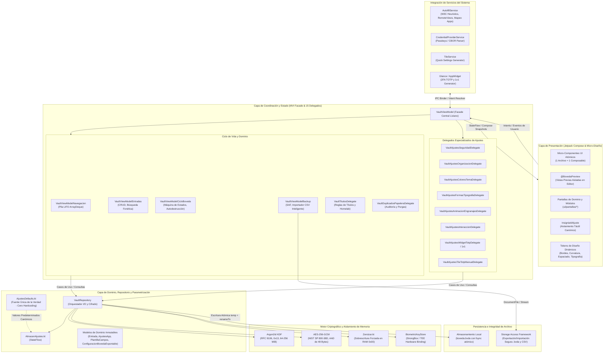
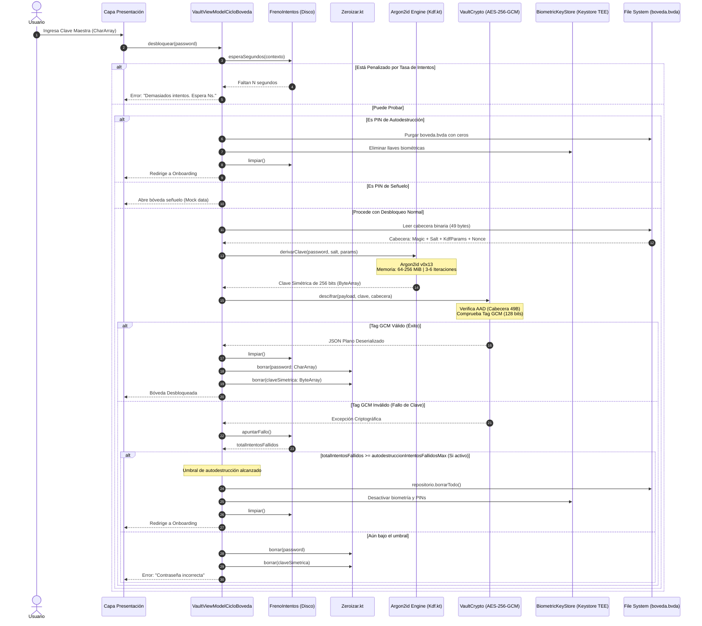
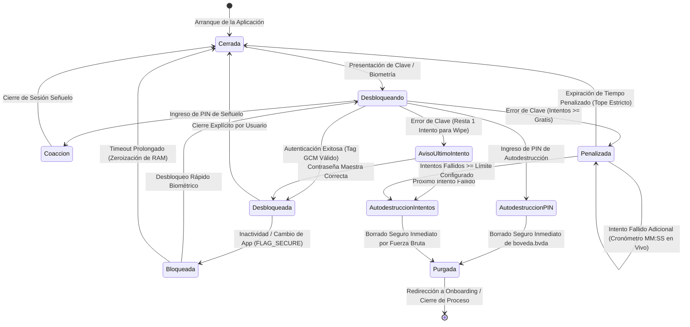
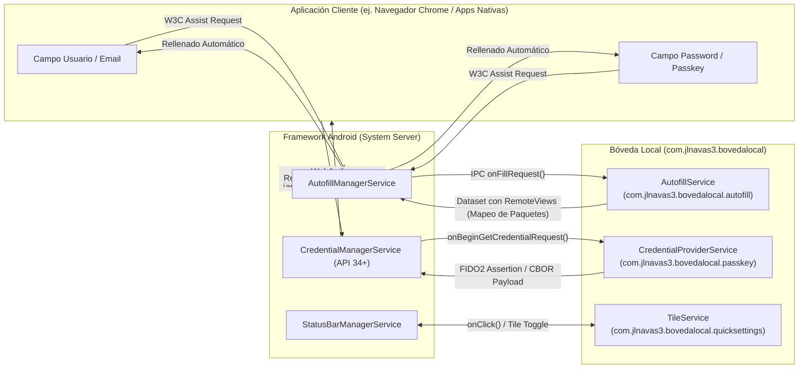

# Arquitectura Técnica de Bóveda Local

## Especificación Formal de Ingeniería y Seguridad Criptográfica

**Bóveda Local** (`com.jlnavas3.bovedalocal`) es una plataforma offline de gestión de credenciales, autenticación de dos factores (**TOTP RFC 6238**), proveedor de llaves de acceso (**Passkeys / WebAuthn FIDO2**) y normalización inteligente de identidades para el sistema operativo Android. La aplicación opera bajo una arquitectura de **Confianza Cero en Red (Zero-Network Architecture)**: el manifiesto de la aplicación carece de forma estricta y absoluta del permiso `android.permission.INTERNET`, haciendo físicamente imposible cualquier exfiltración telemática de datos desde el espacio de usuario.

Este documento detalla la topología de diseño, la orquestación reactiva del estado, la máquina criptográfica formal, los contratos inter-proceso (IPC) con el framework de Android, la parametrización dinámica y el estándar de **Micro-Diseño (1 archivo = 1 composable/clase)** adoptado en el código fuente.

---

## 1. Topología Arquitectónica y Principios de Diseño

El sistema implementa una variante estricta de **Clean Architecture** combinada con **MVI/MVVM (Model-View-Intent / Model-View-ViewModel)**, **Flujo Unidireccional de Datos (UDF - Unidirectional Data Flow)** y un modelo de **Micro-Diseño Atómico** sobre Jetpack Compose.


```mermaid
flowchart TD
    subgraph UI_Presentation ["Capa de Presentación (Jetpack Compose & Micro-Diseño)"]
        Atoms["Micro-Componentes UI Atómicos<br/>(1 Archivo = 1 Composable)"]
        Prevs["@BovedaPreview<br/>(Vistas Previas Aisladas en Editor)"]
        Screens["Pantallas de Dominio y Módulos<br/>(ui/pantallas/*)"]
        Badges["InsigniaIdAjuste<br/>(Aislamiento Táctil Canónico)"]
        Tokens["Tokens de Diseño Dinámicos<br/>(Bordes, Curvatura, Espaciado, Tipografía)"]
    end

    subgraph State_Coordination ["Capa de Coordinación y Estado (MVI Facade & 15 Delegados)"]
        VM["VaultViewModel (Facade Central Liviano)"]
        
        subgraph Sub_Ciclo ["Ciclo de Vida y Dominio"]
            DelNav["VaultViewModelNavegacion<br/>(Pila LIFO ArrayDeque)"]
            DelEnt["VaultViewModelEntradas<br/>(CRUD, Búsqueda Fonética)"]
            DelCic["VaultViewModelCicloBoveda<br/>(Máquina de Estados, Autodestrucción)"]
            DelBkp["VaultViewModelBackup<br/>(SAF, Importador CSV Inteligente)"]
            DelTit["VaultTitulosDelegate<br/>(Reglas de Títulos y Homelab)"]
            DelDup["VaultDuplicadosPapeleraDelegate<br/>(Auditoría y Purgas)"]
        end
        
        subgraph Sub_Ajustes ["Delegados Especializados de Ajustes"]
            DelSeg["VaultAjustesSeguridadDelegate"]
            DelOrg["VaultAjustesOrganizacionDelegate"]
            DelCol["VaultAjustesColoresTemaDelegate"]
            DelGeo["VaultAjustesFormasTipografiaDelegate"]
            DelEng["VaultAjustesAnimacionEngranajesDelegate"]
            DelInt["VaultAjustesInteraccionDelegate"]
            DelWid["VaultAjustesWidgetTotpDelegate / 1x1"]
            DelTil["VaultAjustesTileTotpManualDelegate"]
        end
    end

    subgraph Domain_Repo ["Capa de Dominio, Repositorio y Parametrización"]
        Defaults["AjustesDefaults.kt<br/>(Fuente Única de la Verdad - Cero Hardcoding)"]
        Repo["VaultRepository<br/>(Orquestador I/O y Cifrado)"]
        Almacen["AlmacenAjustes.kt<br/>(StateFlow<AjustesApp>)"]
        Models["Modelos de Dominio Inmutables<br/>(Entrada, AjustesApp, PlantillaCampos, ConfiguracionBovedaExportable)"]
    end

    subgraph Crypto_Engine ["Motor Criptográfico y Aislamiento de Memoria"]
        KDF["Argon2id KDF<br/>(RFC 9106, 0x13, 64-256 MiB)"]
        AES["AES-256-GCM<br/>(NIST SP 800-38D, AAD de 49 Bytes)"]
        Zero["Zeroizar.kt<br/>(Sobrescritura Forzada en RAM 0x00)"]
        Keystore["BiometricKeyStore<br/>(StrongBox / TEE Hardware Binding)"]
    end

    subgraph Persistence ["Persistencia e Integridad de Archivo"]
        FS["Almacenamiento Local<br/>(boveda.bvda con fsync atómico)"]
        SAF["Storage Access Framework<br/>(Exportación/Importación Segura .bvda y CSV)"]
    end

    subgraph Android_System ["Integración de Servicios del Sistema"]
        Autofill["AutofillService<br/>(W3C Heuristics, RemoteViews, Mapeo Apps)"]
        CredMan["CredentialProviderService<br/>(Passkeys / CBOR Parser)"]
        Tile["TileService<br/>(Quick Settings Generator)"]
        Widget["Glance / AppWidget<br/>(2FA TOTP y 1x1 Generator)"]
    end

    %% Relaciones
    UI_Presentation -->|"Intents / Eventos de Usuario"| VM
    VM --> Sub_Ciclo & Sub_Ajustes
    Sub_Ciclo & Sub_Ajustes -->|"Casos de Uso / Consultas"| Repo
    Defaults -.->|"Valores Predeterminados Canónicos"| Almacen
    Repo --> Almacen & KDF & AES & Zero & Keystore
    Repo -->|"Escritura Atómica temp + renameTo"| FS
    DelBkp -->|"DocumentFile / Stream"| SAF
    VM -->|"StateFlow / Compose Snapshots"| UI_Presentation
    Android_System <-->|"IPC Binder / Intent Resolver"| VM
```

### Principios Fundamentales
1. **Separación de Responsabilidades Unidireccional (UDF):** Los componentes de interfaz de usuario emiten eventos e intenciones de forma ascendente. Los delegados procesan la lógica de negocio y emiten instantáneas inmutables de estado (`StateFlow`) hacia abajo.
2. **Estricto Micro-Diseño (1 archivo = 1 composable/clase/función):** Se prohíben archivos monolíticos o definiciones múltiples en un solo archivo fuente. Cada micro-componente, diálogo, fila o tarjeta reside en su propio archivo con su correspondiente vista previa `@BovedaPreview`.
3. **Cero Hardcoding (Fuente Única de la Verdad):** Todos los valores por defecto de la aplicación están unificados de forma canónica en [`AjustesDefaults.kt`](file:///home/jln/BovedaLocal/app/src/main/java/com/jlnavas3/bovedalocal/data/AjustesDefaults.kt). Ningún valor predeterminado se encuentra hardcodeado en la interfaz ni en la lógica de negocio.
4. **Inmutabilidad de Datos en Tránsito:** Las estructuras de datos del dominio (`Entrada`, `AjustesApp`, `PlantillaCamposPersonalizada`) son `data class` inmutables. Toda mutación genera una nueva copia, facilitando el tracking de recomposiciones en Compose.
5. **Tolerancia Cero a Strings en Material Sensible:** Las contraseñas maestras y claves criptográficas efímeras se procesan exclusivamente en buffers primitivos (`CharArray`, `ByteArray`) y se sobrescriben con `0x00` en memoria RAM tras su uso inmediato vía [`Zeroizar.kt`](file:///home/jln/BovedaLocal/app/src/main/java/com/jlnavas3/bovedalocal/crypto/Zeroizar.kt).

---

## 2. Orquestación del Estado: Patrón Facade y 15 Delegados Reactivos

Para evitar la sobrecarga del controlador central (`VaultViewModel`), se implementó el patrón **Facade con Composición de Delegados**. El ViewModel central actúa como un orquestador liviano que expone el estado global e intercomunica **15 delegados y sub-delegados especializados**:

| Delegado | Archivo | Responsabilidad Arquitectónica |
| :--- | :--- | :--- |
| **`VaultViewModelNavegacion`** | [`VaultViewModelNavegacion.kt`](file:///home/jln/BovedaLocal/app/src/main/java/com/jlnavas3/bovedalocal/ui/VaultViewModelNavegacion.kt) | Pila LIFO en memoria (`ArrayDeque<Pantalla>`), resolución jerárquica `padreDe()` y enrutamiento $O(1)$ por identificadores Tri-Grama `irPorId()`. |
| **`VaultViewModelEntradas`** | [`VaultViewModelEntradas.kt`](file:///home/jln/BovedaLocal/app/src/main/java/com/jlnavas3/bovedalocal/ui/VaultViewModelEntradas.kt) | Operaciones CRUD de credenciales, ordenación multi-criterio, motor de búsqueda fonética y filtrado por identidades/categorías. |
| **`VaultViewModelCicloBoveda`** | [`VaultViewModelCicloBoveda.kt`](file:///home/jln/BovedaLocal/app/src/main/java/com/jlnavas3/bovedalocal/ui/VaultViewModelCicloBoveda.kt) | Máquina de estados (cerrada, abierta, señuelo), freno anti-fuerza bruta en disco, autodestrucción por PIN y wipe tras exceder intentos fallidos permitidos. |
| **`VaultViewModelBackup`** | [`VaultViewModelBackup.kt`](file:///home/jln/BovedaLocal/app/src/main/java/com/jlnavas3/bovedalocal/ui/VaultViewModelBackup.kt) | Copias de seguridad automáticas y manuales con SAF, exportación `.bvda` cifrada e importador CSV universal autodetectable. |
| **`VaultTitulosDelegate`** | [`VaultTitulosDelegate.kt`](file:///home/jln/BovedaLocal/app/src/main/java/com/jlnavas3/bovedalocal/ui/VaultTitulosDelegate.kt) | Normalización de títulos de sitios web, reglas de subdominios, marcas oficiales y mapeo de servicios en redes locales (Homelab). |
| **`VaultDuplicadosPapeleraDelegate`** | [`VaultDuplicadosPapeleraDelegate.kt`](file:///home/jln/BovedaLocal/app/src/main/java/com/jlnavas3/bovedalocal/ui/VaultDuplicadosPapeleraDelegate.kt) | Detección inteligente de credenciales duplicadas, selección múltiple para fusión y gestión de papelera con purga temporal programada. |
| **`VaultAjustesSeguridadDelegate`** | [`VaultAjustesSeguridadDelegate.kt`](file:///home/jln/BovedaLocal/app/src/main/java/com/jlnavas3/bovedalocal/ui/VaultAjustesSeguridadDelegate.kt) | Biometría, auto-bloqueo, borrado de portapapeles, FLAG_SECURE, freno de fuerza bruta, seguridad visual y límite de intentos antes de autodestrucción. |
| **`VaultAjustesOrganizacionDelegate`** | [`VaultAjustesOrganizacionDelegate.kt`](file:///home/jln/BovedaLocal/app/src/main/java/com/jlnavas3/bovedalocal/ui/VaultAjustesOrganizacionDelegate.kt) | Jerarquía de identidades/categorías, densidad de lista, índice Niagara, formatos numéricos/regionales y plantillas de campos personalizadas. |
| **`VaultAjustesColoresTemaDelegate`** | [`VaultAjustesColoresTemaDelegate.kt`](file:///home/jln/BovedaLocal/app/src/main/java/com/jlnavas3/bovedalocal/ui/VaultAjustesColoresTemaDelegate.kt) | 20 paletas de acento, colores funcionales de secciones, colores aislados de indicadores de tarjetas y sincronización Material You. |
| **`VaultAjustesFormasTipografiaDelegate`** | [`VaultAjustesFormasTipografiaDelegate.kt`](file:///home/jln/BovedaLocal/app/src/main/java/com/jlnavas3/bovedalocal/ui/VaultAjustesFormasTipografiaDelegate.kt) | Curvatura de esquinas (0–32 dp), grosor de borde, espaciado entre tarjetas, escala tipográfica, familias de fuente e interlineado proporcional. |
| **`VaultAjustesAnimacionEngranajesDelegate`**| [`VaultAjustesAnimacionEngranajesDelegate.kt`](file:///home/jln/BovedaLocal/app/src/main/java/com/jlnavas3/bovedalocal/ui/VaultAjustesAnimacionEngranajesDelegate.kt)| Física y renderizado vectorial del mecanismo de engranajes relojeros y anillos concéntricos de la puerta de bóveda. |
| **`VaultAjustesInteraccionDelegate`** | [`VaultAjustesInteraccionDelegate.kt`](file:///home/jln/BovedaLocal/app/src/main/java/com/jlnavas3/bovedalocal/ui/VaultAjustesInteraccionDelegate.kt) | Respuesta háptica global de la app, destello/alumbrado visual de filas en deep-links y capacidad en memoria del buffer de eventos. |
| **`VaultAjustesWidgetTotpDelegate`** | [`VaultAjustesWidgetTotpDelegate.kt`](file:///home/jln/BovedaLocal/app/src/main/java/com/jlnavas3/bovedalocal/ui/VaultAjustesWidgetTotpDelegate.kt) | Calibración de bordes, curvaturas, transparencia, efecto vidrio esmerilado (*frosted glass*) y háptica en el widget de favoritos 2FA. |
| **`VaultAjustesWidget1x1Delegate`** | [`VaultAjustesWidget1x1Delegate.kt`](file:///home/jln/BovedaLocal/app/src/main/java/com/jlnavas3/bovedalocal/ui/VaultAjustesWidget1x1Delegate.kt) | Modo de generación (aleatoria/Diceware/patrón), dimensiones asimétricas, offsets y apariencia del widget de escritorio 1x1. |
| **`VaultAjustesTileTotpManualDelegate`** | [`VaultAjustesTileTotpManualDelegate.kt`](file:///home/jln/BovedaLocal/app/src/main/java/com/jlnavas3/bovedalocal/ui/VaultAjustesTileTotpManualDelegate.kt) | Parámetros del Quick Settings Tile de Android y algoritmos/períodos del generador manual de códigos TOTP. |

---

## 3. Fuente Única de la Verdad y Parametrización Dinámica

La arquitectura de Bóveda Local erradica completamente los valores fijos o "mágicos" embebidos en el código fuente.


```mermaid
flowchart TD
    subgraph SOT ["Fuente Única de la Verdad (AjustesDefaults.kt)"]
        Def_Seg["1. Seguridad y Acceso"]
        Def_Vis["1b. Seguridad Visual"]
        Def_Tem["2. Tema y Apariencia"]
        Def_Col["3. Colores Secciones"]
        Def_Dat["4. Colores Datos Tarjeta"]
        Def_Ids["5. Colores Bloques Tri-Grama"]
        Def_Geo["6. Formas y Geometría"]
        Def_Typ["7. Tipografía y Textos"]
        Def_Aut["8. Autocompletado y Ecosistema"]
        Def_Ind["8b. Índice Alfabético Niagara"]
        Def_Ani["9. Animación Engranajes/Puerta"]
        Def_Wgt["10. Widgets TOTP y 1x1"]
        Def_Til["11. Quick Settings Tile"]
        Def_Lst["12. Lista y Formatos Regionales"]
        Def_Tot["13. TOTP Manual"]
        Def_Cop["14. Historial, Copias y Retención"]
        Def_Int["15. UI / Háptica / Alumbrado"]
        Def_Tit["16. Normalización Títulos y Homelab"]
        Def_Gen["17. Generador de Claves y Frases"]
        Def_Csv["18. Importación CSV"]
        Def_Dgn["19. Diagnóstico y Registro"]
        Def_Plt["20. Plantillas de Campos"]
    end

    subgraph Store ["Persistencia y Estado (AlmacenAjustes.kt)"]
        SP["SharedPreferences ('ajustes_boveda')"]
        State["StateFlow<AjustesApp>"]
    end

    subgraph Consumers ["Consumidores Reactivos"]
        UI["Compose UI (Recomposición Fluida 120Hz)"]
        Crypto["Motor Criptográfico y Rate Limit"]
        AutofillSvc["Android Autofill / Passkeys"]
        Widgets["AppWidgets de Escritorio"]
    end

    SOT -->|"Valores Predeterminados Inmutables"| Store
    Store --> Consumers
```

### Inventario de Parametrización Dinámica Implementada
1. **Normalización de Títulos y Redes Locales:**
   - Catálogo de marcas oficiales editable (`marcasPersonalizadas`).
   - Mapeo de servicios homelab y puertos (`puertosServiciosLocales`: 8006 Proxmox, 9000 Portainer, 8123 Home Assistant, etc.).
   - Octetos configurables de router (`octetosRouter`: 1, 254).
2. **Autocompletado y Ecosistema de Aplicaciones:**
   - Mapeo configurable de paquetes Android a dominios web (`mapeoPaquetesPersonalizados`).
   - Lista dinámica de navegadores web del sistema (`navegadoresPersonalizados`).
   - Selector dinámico de límite de sugerencias en pantalla (`maxSugerenciasAutofill`).
3. **Generador Criptográfico y Frases Diceware:**
   - Switch configurable para excluir caracteres ambiguos (`excluirAmbiguos`).
   - Longitud máxima ampliada hasta 128 caracteres (`AjustesDefaults.Generador.LONGITUD_MAX`).
   - Soporte bilingüe BIP-39 (Español e Inglés con 2,048 palabras) y opción de capitalización de palabras (`capitalizarFrases`).
4. **Importación CSV Universal Inteligente:**
   - Detección automática en tiempo real de delimitadores: coma (`,`), punto y coma (`;`) y tabulador (`\t`).
   - Compatibilidad completa con Bitwarden, KeePass, Google Passwords y exportaciones de Excel en español.
5. **Diagnóstico y Capacidad del Registro:**
   - Buffer dinámico en memoria parametrizable (`diagnosticoMaxEventos`: 100, 200, 500, 1000) sincronizado en vivo.
6. **Plantillas de Campos Personalizadas:**
   - Modelo serializable [`PlantillaCamposPersonalizada.kt`](file:///home/jln/BovedaLocal/app/src/main/java/com/jlnavas3/bovedalocal/data/PlantillaCamposPersonalizada.kt) que permite guardar esquemas recurrentes de credenciales como plantillas reutilizables.
7. **Autodestrucción por Intentos Fallidos Consecutivos:**
   - Umbral de intentos fallidos antes de purga total (`autodestruccionIntentosFallidosMax`: 0/desactivado, 5, 10, 15, 20) supervisado por [`FrenoIntentos.kt`](file:///home/jln/BovedaLocal/app/src/main/java/com/jlnavas3/bovedalocal/data/FrenoIntentos.kt).

---

## 4. Estándar Global de Identificadores Jerárquicos Tri-Grama

La aplicación implementa una taxonomía de identificación jerárquica canónica basada en **Tri-Gramas con separación por guiones**:

$$\text{ID Canónico} = \mathbf{XX}\text{-}\mathbf{YYY}[\text{-}\mathbf{ZZZ}[\text{-}\mathbf{Gnn}]]$$


```mermaid
flowchart TD
    Root["00-AJU (Hub Central de Ajustes)"]
    
    B01["01-SEG (Seguridad)"]
    B02["02-APA (Apariencia)"]
    B03["03-LST (Lista y Bóveda)"]
    B04["04-HER (Herramientas)"]
    B05["05-COP (Copias y Respaldo)"]
    B06["06-SIS (Sistema y Auditoría)"]

    Root --> B01 & B02 & B03 & B04 & B05 & B06

    %% Submódulos 01
    B01 --> B01_BIO["01-SEG-BIO (Biometría StrongBox)"]
    B01 --> B01_PAS["01-SEG-PAS (Clave Maestra)"]
    B01 --> B01_SNU["01-SEG-SNU (Bóveda Señuelo)"]
    B01 --> B01_DES["01-SEG-DES (Autodestrucción: PIN e Intentos)"]
    B01 --> B01_ARG["01-SEG-ARG (Perfil Argon2id)"]
    B01 --> B01_VIS["01-SEG-VIS (Seguridad Visual)"]

    %% Submódulos 02
    B02 --> B02_THM["02-APA-THM (Tema y 20 Paletas)"]
    B02 --> B02_ANI["02-APA-ANI (Engranajes y Puerta)"]
    B02 --> B02_GEO["02-APA-GEO (Curvatura, Grosor, Espaciado)"]
    B02 --> B02_TYP["02-APA-TYP (Tipografía e Interlineado)"]

    %% Submódulos 03
    B03 --> B03_AZX["03-LST-AZX (Índice Niagara con Ola)"]
    B03 --> B03_SLD["03-LST-SLD (Salud de la Bóveda)"]
    B03 --> B03_DUP["03-LST-DUP (Limpieza de Duplicados)"]
    B03 --> B03_PAP["03-LST-PAP (Papelera Programada)"]
    B03 --> B03_TIT["03-LST-TIT (Normalizador Títulos y Redes)"]
    B03 --> B03_PLT["03-LST-PLT (Plantillas de Campos Personalizadas)"]

    %% Submódulos 04
    B04 --> B04_GEN["04-HER-GEN (Generador CSPRNG / BIP-39)"]
    B04 --> B04_2FA["04-HER-2FA (Autenticador TOTP)"]
    B04 --> B04_HST["04-HER-HST (Historial Temporal)"]
    B04 --> B04_WGT["04-HER-WGT (Widgets TOTP y 1x1)"]

    %% Submódulos 05
    B05 --> B05_EXP["05-COP-EXP (Exportación .bvda)"]
    B05 --> B05_ATM["05-COP-ATM (Copia Automática SAF)"]
    B05 --> B05_CSV["05-COP-CSV (Importador CSV Multiformato)"]

    %% Submódulos 06
    B06 --> B06_DGN["06-SIS-DGN (Diagnóstico Hardware/RAM)"]
    B06 --> B06_LOG["06-SIS-LOG (Registro de Eventos y Capacidad)"]
    B06 --> B06_ACR["06-SIS-ACR (Acerca de la Bóveda)"]
```

---

## 5. Pipeline Criptográfico y Seguridad en Memoria


```mermaid
sequenceDiagram
    autonumber
    actor Usuario
    participant UI as Capa Presentación
    participant VM as VaultViewModelCicloBoveda
    participant Freno as FrenoIntentos (Disco)
    participant Zero as Zeroizar.kt
    participant KDF as Argon2id Engine (Kdf.kt)
    participant AES as VaultCrypto (AES-256-GCM)
    participant KS as BiometricKeyStore (Keystore TEE)
    participant FS as File System (boveda.bvda)

    Usuario->>UI: Ingresa Clave Maestra (CharArray)
    UI->>VM: desbloquear(password)
    
    VM->>Freno: esperaSegundos(contexto)
    alt Está Penalizado por Tasa de Intentos
        Freno-->>VM: Faltan N segundos
        VM-->>UI: Error: "Demasiados intentos. Espera Ns."
    else Puede Probar
        alt Es PIN de Autodestrucción
            VM->>FS: Purgar boveda.bvda con ceros
            VM->>KS: Eliminar llaves biométricas
            VM->>Freno: limpiar()
            VM-->>UI: Redirige a Onboarding
        else Es PIN de Señuelo
            VM-->>UI: Abre bóveda señuelo (Mock data)
        else Procede con Desbloqueo Normal
            VM->>FS: Leer cabecera binaria (49 bytes)
            FS-->>VM: Cabecera: Magic + Salt + KdfParams + Nonce
            
            VM->>KDF: derivarClave(password, salt, params)
            Note over KDF: Argon2id v0x13<br/>Memoria: 64-256 MiB | 3-6 Iteraciones
            KDF-->>VM: Clave Simétrica de 256 bits (ByteArray)
            
            VM->>AES: descifrar(payload, clave, cabecera)
            Note over AES: Verifica AAD (Cabecera 49B)<br/>Comprueba Tag GCM (128 bits)
            
            alt Tag GCM Válido (Éxito)
                AES-->>VM: JSON Plano Deserializado
                VM->>Freno: limpiar()
                VM->>Zero: borrar(password: CharArray)
                VM->>Zero: borrar(claveSimetrica: ByteArray)
                VM-->>UI: Bóveda Desbloqueada
            else Tag GCM Inválido (Fallo de Clave)
                AES-->>VM: Excepción Criptográfica
                VM->>Freno: apuntarFallo()
                Freno-->>VM: totalIntentosFallidos
                
                alt totalIntentosFallidos >= autodestruccionIntentosFallidosMax (Si activo)
                    Note over VM: Umbral de autodestrucción alcanzado
                    VM->>FS: repositorio.borrarTodo()
                    VM->>KS: Desactivar biometría y PINs
                    VM->>Freno: limpiar()
                    VM-->>UI: Redirige a Onboarding
                else Aún bajo el umbral
                    VM->>Zero: borrar(password)
                    VM->>Zero: borrar(claveSimetrica)
                    VM-->>UI: Error: "Contraseña incorrecta"
                end
            end
        end
    end
```

### Estructura Binaria Inmutable de la Cabecera `BVDA`
El archivo físico `boveda.bvda` comienza con una cabecera binaria inmutable de **49 bytes**, inyectada como **Datos Asociados Autenticados (AAD)**:

```text
Offset (Bytes)   Longitud (Bytes)   Campo               Descripción
----------------------------------------------------------------------------------------
00..03           04                 MAGIC               Glifo constante 0x42 0x56 0x44 0x41 ("BVDA")
04               01                 VERSION             Versión de esquema binario (0x01)
05..20           16                 SALT                Sal criptográfica CSPRNG para Argon2id
21..24           04                 MEMORY_KIB          Memoria RAM asignada a Argon2id (Big Endian)
25..28           04                 ITERATIONS          Iteraciones de paso para Argon2id (Big Endian)
29..32           04                 PARALLELISM         Lanes de paralelismo para Argon2id (Big Endian)
33..36           04                 HASH_LENGTH         Longitud de salida de clave = 32 (Big Endian)
37..48           12                 NONCE               Vector de inicialización único para AES-GCM
----------------------------------------------------------------------------------------
Total Cabecera:  49 Bytes
49..N-16         Variable           CIPHERTEXT          Datos JSON serializados y cifrados (ContenidoBoveda)
N-16..N          16                 TAG_GCM             Etiqueta de autenticación de 128 bits
```

### Estructura del Carga Útil Cifrada (`ContenidoBoveda`)
El bloque `CIPHERTEXT` desencriptado produce la estructura canónica en formato JSON (`ContenidoBoveda.kt`):

```json
{
  "version": 1,
  "entradas": [ ... ],
  "papelera": [ ... ],
  "colecciones": [ ... ],
  "identidades": [ ... ],
  "configuracion": {
    "prefijosSubdominios": [ "api", "auth", "vpn", ... ],
    "tldsDescartables": [ "local", "internal", ... ],
    "marcasPersonalizadas": { "proxmox.home": "Proxmox VE", ... },
    "puertosServiciosLocales": { "8006": "Proxmox", "8123": "Home Assistant", ... },
    "octetosRouter": [ 1, 254 ],
    "plantillasCamposPersonalizadas": [ ... ],
    "autoBloqueoSegundos": 600,
    "frenoIntentosGratis": 3,
    "frenoSegundosMax": 300,
    "autodestruccionIntentosFallidosMax": 10,
    "autofillSugerenciasTeclado": true,
    ...
  }
}
```

#### Modelo de Sincronización Bidireccional de Configuración
1. **Inclusión en Exportación y Persistencia:** Al guardar o exportar la bóveda (`persistir()`, `exportar()`), el repositorio extrae la configuración funcional activa mediante `ajustes.actual.aConfiguracionExportable()`.
2. **Exclusión Estricta de Temas:** Las preferencias de personalización visual (paletas de acento, colores de tarjetas/títulos, familias tipográficas, formas de bordes y animaciones relojeras) quedan expresamente fuera de `ConfiguracionBovedaExportable`. Esto previene que una importación sobreescriba la estética elegida en el dispositivo cliente.
3. **Restauración Automática al Abrir:** Al desbloquear con contraseña o huella (`desbloquear()`), o al importar una copia (`importar()`), si el payload contiene `configuracion`, se aplica inmediatamente sobre `AlmacenAjustes` restaurando todas las reglas sin fisuras.
4. **Sincronización Reactiva en Caliente:** Cualquier mutación en `AlmacenAjustes` dispara el listener `alActualizar`. Si la bóveda se encuentra en estado `Desbloqueada`, las nuevas reglas se persisten atómicamente en disco.

---

## 6. Máquina de Estados Finita y Ciclo de Vida de Seguridad


```mermaid
stateDiagram-v2
    [*] --> Cerrada: Arranque de la Aplicación

    Cerrada --> Desbloqueando: Presentación de Clave / Biometría
    
    Desbloqueando --> Desbloqueada: Autenticación Exitosa (Tag GCM Válido)
    Desbloqueando --> Coaccion: Ingreso de PIN de Señuelo
    Desbloqueando --> AutodestruccionPIN: Ingreso de PIN de Autodestrucción
    Desbloqueando --> AvisoUltimoIntento: Error de Clave (Resta 1 Intento para Wipe)
    Desbloqueando --> Penalizada: Error de Clave (Intentos >= Gratis)
    
    AvisoUltimoIntento --> AutodestruccionIntentos: Próximo Intento Fallido
    AvisoUltimoIntento --> Desbloqueada: Contraseña Maestra Correcta
    
    Penalizada --> Penalizada: Intento Fallido Adicional (Cronómetro MM:SS en Vivo)
    Penalizada --> AutodestruccionIntentos: Intentos Fallidos >= Límite Configurado
    Penalizada --> Cerrada: Expiración de Tiempo Penalizado (Tope Estricto)

    Desbloqueada --> Bloqueada: Inactividad / Cambio de App (FLAG_SECURE)
    Bloqueada --> Desbloqueando: Desbloqueo Rápido Biométrico
    Bloqueada --> Cerrada: Timeout Prolongado (Zeroización de RAM)

    Desbloqueada --> Cerrada: Cierre Explícito por Usuario
    Coaccion --> Cerrada: Cierre de Sesión Señuelo
    
    AutodestruccionPIN --> Purgada: Borrado Seguro Inmediato de boveda.bvda
    AutodestruccionIntentos --> Purgada: Borrado Seguro Inmediato por Fuerza Bruta
    Purgada --> [*]: Redirección a Onboarding / Cierre de Proceso
```

---

## 7. Integración de Servicios del Sistema Android e IPC


```mermaid
flowchart LR
    subgraph Client_App ["Aplicación Cliente (ej. Navegador Chrome / Apps Nativas)"]
        InputUser["Campo Usuario / Email"]
        InputPass["Campo Password / Passkey"]
    end

    subgraph Android_OS ["Framework Android (System Server)"]
        AutofillManager["AutofillManagerService"]
        CredentialManager["CredentialManagerService (API 34+)"]
        QuickSettingsServer["StatusBarManagerService"]
    end

    subgraph Boveda_IPC ["Bóveda Local (com.jlnavas3.bovedalocal)"]
        AFS["AutofillService<br/>(com.jlnavas3.bovedalocal.autofill)"]
        CPS["CredentialProviderService<br/>(com.jlnavas3.bovedalocal.passkey)"]
        QSS["TileService<br/>(com.jlnavas3.bovedalocal.quicksettings)"]
    end

    InputUser & InputPass -->|"W3C Assist Request"| AutofillManager
    AutofillManager -->|"IPC onFillRequest()"| AFS
    AFS -->|"Dataset con RemoteViews (Mapeo de Paquetes)"| AutofillManager
    AutofillManager -->|"Rellenado Automático"| InputUser & InputPass

    Client_App -->|"WebAuthn navigator.credentials.get()"| CredentialManager
    CredentialManager -->|"onBeginGetCredentialRequest()"| CPS
    CPS -->|"FIDO2 Assertion / CBOR Payload"| CredentialManager
    CredentialManager -->|"Resultado FIDO2 / Passkey"| Client_App

    QuickSettingsServer <-->|"onClick() / Tile Toggle"| QSS
```

---

## 8. Micro-Diseño y Sistema de Componentes Compose

Siguiendo el principio de **1 archivo = 1 componente**:
1. **Desacoplamiento Estricto:** Toda pantalla está compuesta exclusivamente por micro-componentes especializados ubicados en sus subpaquetes de dominio correspondientes.
2. **Vistas Previas Universalizadas (`@BovedaPreview`):** Cada componente nuevo incluye una función `@Composable private fun [Componente]Preview()` anotada con `@BovedaPreview`, asegurando renderizado estático en Android Studio sin requerir ejecución en dispositivo.
3. **Ergonomía Samsung One UI 6 / MagicOS:**
   - Botones primarios y conmutadores situados en la mitad inferior de la pantalla.
   - Doble FAB vertical en Listado, Generador y Autenticador.
   - Menú de tres puntos con submenús compactos de altura ergonómica ($38\text{ dp}$).

---

## 9. Estructura Exhaustiva de Paquetes del Repositorio

El código fuente de `app/src/main/java/com/jlnavas3/bovedalocal/` está organizado en **59 submódulos de alta cohesión**:

```text
com.jlnavas3.bovedalocal/
├── BovedaApp.kt                          # Application class: inyección y ciclo de vida
├── autofill/                             # Subsistema Android Autofill Framework
│   ├── BovedaAutofillService.kt          # Servicio interceptor de eventos de autorrellenado
│   ├── AutofillUtiles.kt                 # Parser de estructura de accesibilidad y heurísticas W3C
│   ├── GestorMapeoPaquetes.kt            # Mapeo configurable de apps nativas a dominios web
│   └── FiltroNavegadoresWeb.kt           # Detección y filtrado de navegadores instalados
├── camara/                               # Motor de decodificación y captura óptica de QR (CameraX)
├── crypto/                               # Núcleo de seguridad criptográfica y gestión de claves
│   ├── Argon2Kdf.kt / Kdf.kt             # Binding de Argon2id (RFC 9106, v0x13, 64-256 MiB)
│   ├── VaultCrypto.kt                    # AES-256-GCM, cabecera BVDA de 49B y validación AAD
│   ├── BiometricKeyStore.kt              # Integración con Android Keystore TEE / StrongBox
│   ├── PasswordGenerator.kt              # Generador CSPRNG, zxcvbn, patrones y Diceware
│   ├── Wordlist.kt / WordlistEn.kt       # Diccionarios BIP-39 bilingües (Español / Inglés 2,048 palabras)
│   ├── Totp.kt / OtpAuth.kt              # Generador TOTP RFC 6238 y parser otpauth://
│   └── Zeroizar.kt                       # Sobrescritura inmediata de buffers RAM con 0x00
├── cxf/                                  # Exportador de credenciales en formato seguro
├── data/                                 # Capa de datos, modelos inmutables y persistencia
│   ├── Ajustes.kt / AlmacenAjustes.kt    # Data class AjustesApp y SharedPreferences reactivas
│   ├── AjustesDefaults.kt                # FUENTE ÚNICA DE LA VERDAD (Todos los valores por defecto)
│   ├── FrenoIntentos.kt                  # Conteo atómico en disco y tasa de limitación
│   ├── ImportadorCsv.kt                  # Parser CSV universal con autodetección de delimitadores
│   ├── NormalizadorTitulosSitios.kt      # Algoritmo de normalización de marcas y títulos
│   ├── ClasificadorRedLocal.kt           # Detección de homelab, routers y puertos locales
│   ├── PresetsCampos.kt                  # Conjuntos rápidos del sistema y unión con personalizadas
│   ├── PlantillaCamposPersonalizada.kt   # Modelo de esquemas de campos guardados por el usuario
│   ├── Entrada.kt / CampoPersonalizado.kt# Entidades inmutables de credenciales de la bóveda
│   └── VaultRepository.kt                # Repositorio unificado I/O, descifrado y fsync atómico
├── passkey/                              # Credential Provider Framework (Android 14+ / CBOR)
├── quicksettings/                        # Quick Settings Tile Service (Generador rápido)
├── ui/                                   # Capa de presentación (Jetpack Compose UI)
│   ├── MainActivity.kt                   # Single-Activity, política FLAG_SECURE y orquestador
│   ├── Pantalla.kt                       # Sealed Class jerárquica con el catálogo de rutas
│   ├── VaultViewModel.kt                 # ViewModel Facade central
│   ├── VaultViewModelCicloBoveda.kt      # Delegado de máquina de estados, bloqueo y autodestrucción
│   ├── VaultViewModelEntradas.kt         # Delegado CRUD de credenciales, búsqueda y filtros
│   ├── VaultViewModelNavegacion.kt       # Delegado de pila LIFO y resolución canónica padreDe()
│   ├── VaultViewModelBackup.kt           # Delegado de SAF, exportación e importación CSV
│   ├── VaultTitulosDelegate.kt           # Delegado de normalización de marcas y homelab
│   ├── VaultDuplicadosPapeleraDelegate.kt# Delegado de auditoría de duplicados y papelera
│   ├── VaultAjustes*Delegate.kt          # Sub-delegados especializados de configuración (Seguridad,
│   │                                     # Organización, Tema, Formas, Engranajes, Interacción, Widgets, Tile)
│   ├── componentes/                      # Catálogo de micro-componentes atómicos de Compose
│   │   ├── InsigniaValorBoveda.kt        # Badges semánticos cromáticos
│   │   ├── BotonBoveda.kt / BotonColorido# Botones de tema dinámico y háptica
│   │   ├── CampoBoveda.kt                # Inputs de texto formateados
│   │   ├── MenuDesplegableBoveda.kt      # Menús desplegables compactos y submenús multinivel
│   │   ├── ajustes/                      # InsigniaIdAjuste, ComponenteGrupo, FilasAjustes, Selectores
│   │   └── seleccion/                    # Barras de selección múltiple
│   ├── pantallas/                        # Submódulos y pantallas organizadas por dominio
│   │   ├── lista/                        # Bóveda principal, búsqueda, gestos y doble FAB
│   │   ├── ajustes/                      # Hub central de ajustes y catálogo modular
│   │   ├── autenticador/                 # Gestor 2FA TOTP con temporizadores de cuenta atrás
│   │   ├── autocompletado/               # Ajustes de autofill y reglas de paquetes Android
│   │   ├── autodestruccion/              # Alerta crítica, PIN de emergencia e intentos fallidos
│   │   ├── calibracion/                  # Simuladores de engranajes relojeros y widgets
│   │   ├── detalle/                      # Ficha de credencial con swipe y comparación
│   │   ├── duplicados/                   # Selector y fusión de credenciales duplicadas
│   │   ├── edicion/                      # Edición reactiva con plantillas de campos personalizadas
│   │   ├── generador/                    # Generador visual con zxcvbn y modo Diceware bilingüe
│   │   ├── passkeys/                     # Gestor de llaves de acceso FIDO2
│   │   ├── registro/                     # Visor de eventos y selector modal de capacidad
│   │   ├── titulos/                      # Normalizador de títulos, subdominios y homelab
│   │   └── ...                           # (Formas, Tipografía, Colores, Papelera, Salud, Copia, etc.)
│   ├── preview/                          # Anotaciones @BovedaPreview para previsualización Compose
│   └── theme/                            # Tokens dinámicos (Colores, Formas, Tipografía, Tema)
├── util/                                 # Utilidades transversales (Diagnóstico, Háptica, Hardware)
└── widget/                               # Implementación de AppWidgets de escritorio (2FA y 1x1)
```

---

## 10. Directrices de Calidad y Verificación

1. **Batería de Pruebas Unitarias Automatizadas:** El repositorio incluye **346 pruebas unitarias** ejecutadas bajo `./gradlew testDebugUnitTest`. Estas verifican:
   - Derivación y cifrado NIST AES-256-GCM y RFC 9106 Argon2id.
   - Generación TOTP RFC 6238 con verificación de ventanas de sincronización.
   - Enrutamiento jerárquico Tri-Grama `padreDe()`.
   - Normalización de títulos y reglas de subdominios.
   - Detección automática de delimitadores CSV (coma, punto y coma, tabulador) y parsing seguro con comillas.
   - Diccionario BIP-39 bilingüe (Español/Inglés) y exclusión de ambiguos en el generador.
   - Ajuste dinámico en memoria de la capacidad del buffer de diagnóstico.
   - Serialización de plantillas de campos personalizadas y combinación con presets estándar.
   - Tasa de limitación exponencial y cálculo de umbral de autodestrucción por intentos fallidos.
2. **Auditoría de Dependencias y Red:** En cada compilación Release, el analizador de manifiesto de Gradle valida que no se introduzca ninguna dependencia transitiva que solicite permisos de red o telemetría de terceros.
