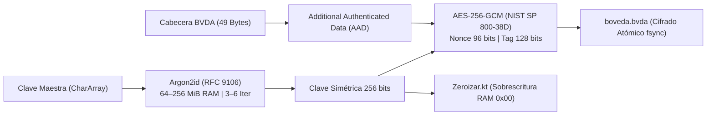

# Bóveda Local

[](https://kotlinlang.org/)
[](https://developer.android.com/jetpack/compose)
[](https://developer.android.com/)
[](https://gradle.org/)
[](https://github.com/)
[](https://github.com/)
[](https://opensource.org/licenses/MIT)

**Bóveda Local** (`com.jlnavas3.bovedalocal`) es una plataforma de alta seguridad criptográfica y privacidad absoluta para la custodia local de credenciales, autenticación de dos factores (**TOTP RFC 6238**), proveedor nativo de llaves de acceso (**Passkeys / WebAuthn FIDO2**) y normalización inteligente de identidades en Android.

La aplicación opera bajo una estricta política de **Confianza Cero en Red (Zero-Network Architecture)**: carece por diseño de cualquier interfaz telemática en su manifiesto, garantizando que el material sensible jamás abandone los confines de la memoria volátil del dispositivo.

---

## 🛡️ Modelo de Aislamiento y Permisos

Bóveda Local no solicita ni declara permisos de conectividad a redes en su manifiesto (`AndroidManifest.xml`). Es telemáticamente hermética.

```xml
<!-- Manifiesto de Seguridad de Bóveda Local: CERO permisos de red -->
<manifest xmlns:android="http://schemas.android.com/apk/res/android">
    <!-- NO EXISTE: <uses-permission android:name="android.permission.INTERNET" /> -->
    <!-- NO EXISTE: <uses-permission android:name="android.permission.ACCESS_NETWORK_STATE" /> -->

    <uses-permission android:name="android.permission.USE_BIOMETRIC" />
    <uses-permission android:name="android.permission.VIBRATE" />
    <uses-permission android:name="android.permission.CAMERA" /> <!-- Solo escáner QR local -->
</manifest>
```

| Permiso | Tipo | Justificación Técnica de Seguridad |
| :--- | :--- | :--- |
| `android.permission.USE_BIOMETRIC` | Normal | Autenticación biométrica de hardware de Clase 3 (Fuerte) o Clase 2 (Compatible) para liberar la clave maestra envuelta en el Android Keystore (`BiometricPrompt.CryptoObject`). |
| `android.permission.VIBRATE` | Normal | Respuesta háptica sub-milisegúndica en eventos de confirmación, validación de clave y deslizamiento en el índice alfabético Niagara. |
| `android.permission.CAMERA` | Peligroso (Runtime) | Lectura óptica en memoria de códigos QR estándar para tokens 2FA (`otpauth://totp/...`). El flujo óptico CameraX se decodifica en un hilo secundario y jamás persiste imágenes en disco. |

---

## 🔐 Especificación Criptográfica y Ciclo de Vida

El motor criptográfico de Bóveda Local prescinde de librerías propietarias y se adhiere a primitivas avaladas por el NIST y la IETF:



### 1. Derivación de Clave: Argon2id (RFC 9106)
Resistente a ataques de compensación tiempo-memoria (TMTO) y computación masiva en clústeres GPU/ASIC mediante la variante híbrida `Argon2id` (v0x13):
* **Perfil Estándar:** 64 MiB RAM ($65,536\text{ KiB}$), 3 iteraciones, paralelismo = 4 lanes ($\approx 150\text{ ms}$).
* **Perfil Reforzado:** 128 MiB RAM ($131,072\text{ KiB}$), 4 iteraciones, paralelismo = 4 lanes ($\approx 300\text{ ms}$).
* **Perfil Ultra-Seguro:** 256 MiB RAM ($262,144\text{ KiB}$), 6 iteraciones, paralelismo = 4 lanes ($\approx 600\text{ ms}$).

### 2. Cifrado Autenticado: AES-256-GCM con Cabecera AAD
* **Cifrador:** `AES/GCM/NoPadding` con clave simétrica de 256 bits derivada por KDF.
* **Vector de Inicialización (Nonce):** 96 bits (12 bytes) CSPRNG generados individualmente en cada guardado.
* **Cabecera Inmutable Autenticada (49 Bytes):**
  `[MAGIC: 4B ("BVDA")][VERSION: 1B (0x01)][SALT: 16B][MEM: 4B][ITER: 4B][PAR: 4B][LEN: 4B][NONCE: 12B]`.
  La cabecera completa se vincula como **AAD** mediante `cipher.updateAAD(cabecera)`. Cualquier intento de alterar los parámetros de la cabecera (como reducir los requisitos de memoria de Argon2id) produce de inmediato una falla de integridad (`AEADBadTagException`).

### 3. Gestión y Purga de Memoria Volátil (Zeroización)
Se prohíbe el uso de cadenas inmutables (`java.lang.String`) para secretos. Toda clave o contraseña temporal reside en buffers primitivos (`CharArray`, `ByteArray`) y es inmediatamente sobrescrita con bytes nulos (`0x00`) tras su uso mediante [`Zeroizar.kt`](file:///home/jln/BovedaLocal/app/src/main/java/com/jlnavas3/bovedalocal/crypto/Zeroizar.kt).

### 4. Enlace Biométrico con Android Keystore
Al activar el desbloqueo por huella, la clave maestra se cifra y almacena en el Keystore respaldado por hardware seguro (**TEE / StrongBox Keymaster**). La clave solo se libera tras una autenticación biométrica exitosa validada por el framework del sistema mediante `BiometricPrompt.CryptoObject`.

---

## 🏛️ Arquitectura de Software y Micro-Diseño

El proyecto adopta **Clean Architecture** estructurada en MVI/MVVM con Jetpack Compose bajo un estricto principio de **Micro-Diseño (1 archivo = 1 componente/clase/función)** y soporte universal de vistas previas con `@BovedaPreview`.

El controlador central [`VaultViewModel.kt`](file:///home/jln/BovedaLocal/app/src/main/java/com/jlnavas3/bovedalocal/ui/VaultViewModel.kt) opera como una **Fachada Reactiva** desacoplada en delegados de ciclo y sub-delegados de dominio:

```mermaid
flowchart TD
    VM["VaultViewModel (Facade Central)"]
    
    subgraph Ciclo_Navegacion ["Ciclo, Navegación y CRUD"]
        VM --> D_Nav["VaultViewModelNavegacion<br/>Pila LIFO ArrayDeque + padreDe()"]
        VM --> D_Ent["VaultViewModelEntradas<br/>CRUD, Búsqueda Fonética, Filtros"]
        VM --> D_Cic["VaultViewModelCicloBoveda<br/>Desbloqueo, Autodestrucción, Rate Limit"]
        VM --> D_Bkp["VaultViewModelBackup<br/>SAF, Exportación .bvda, CSV Dinámico"]
        VM --> D_Tit["VaultTitulosDelegate<br/>Normalización de Títulos y Homelab"]
        VM --> D_Dup["VaultDuplicadosPapeleraDelegate<br/>Detección de Duplicados y Purga"]
    end
    
    subgraph Delegados_Ajustes ["Delegados Especializados de Ajustes"]
        VM --> D_Seg["VaultAjustesSeguridadDelegate<br/>Biometría, Freno Intentos, Wipe"]
        VM --> D_Org["VaultAjustesOrganizacionDelegate<br/>Plantillas Campos, Formatos, Índices"]
        VM --> D_Col["VaultAjustesColoresTemaDelegate<br/>Paletas de Acento, Colores Secciones"]
        VM --> D_Geo["VaultAjustesFormasTipografiaDelegate<br/>Curvatura, Grosor, Tipografía"]
        VM --> D_Eng["VaultAjustesAnimacionEngranajesDelegate<br/>Física y Visual de Engranajes/Puerta"]
        VM --> D_Int["VaultAjustesInteraccionDelegate<br/>Háptica Global, Alumbrado, Registro"]
        VM --> D_Wid["VaultAjustesWidgetTotpDelegate / 1x1<br/>Calibración y Vidrio Esmerilado"]
        VM --> D_Til["VaultAjustesTileTotpManualDelegate<br/>Quick Settings Tile y 2FA Manual"]
    end
```



---

## 🎛️ Parametrización Dinámica Total (Cero Hardcoding)

Todos los valores predeterminados de la aplicación residen de forma canónica en [`AjustesDefaults.kt`](file:///home/jln/BovedaLocal/app/src/main/java/com/jlnavas3/bovedalocal/data/AjustesDefaults.kt). Ninguna constante se encuentra hardcodeada en pantallas o ViewModels:

1. **Normalización de Títulos y Homelab:** Catálogo dinámico de marcas (`marcasPersonalizadas`), mapeo de puertos y servicios locales (`puertosServiciosLocales`), y octetos de router (`octetosRouter`).
2. **Autocompletado y Ecosistema Android:** Mapeo configurable de paquetes de apps a dominios (`mapeoPaquetesPersonalizados`), lista editable de navegadores web (`navegadoresPersonalizados`), y selector de límite de sugerencias de Autofill (`maxSugerenciasAutofill`).
3. **Generador y Frases de Paso:** Exclusión de caracteres ambiguos (`excluirAmbiguos`), longitud extendida hasta 128 caracteres, diccionario bilingüe BIP-39 (Español / Inglés con 2,048 palabras) y opción de capitalización de palabras (`Capitalize Words`).
4. **Importación CSV Universal:** Motor con autodetección de delimitadores (coma `,`, punto y coma `;` y tabulador `\t`), compatible con Bitwarden, KeePass, Google Passwords y Excel en español.
5. **Diagnóstico y Capacidad del Registro:** Capacidad en memoria parametrizable (`diagnosticoMaxEventos`: 100, 200, 500, 1000) con sincronización reactiva inmediata.
6. **Plantillas de Campos Personalizadas:** Creación y guardado de esquemas recurrentes de campos (`PlantillaCamposPersonalizada.kt`) integradas en el selector rápido de presets.
7. **Autodestrucción por Intentos Fallidos y Aviso de Último Intento:** Wipe automático total de la base de datos tras $N$ intentos consecutivos fallidos de contraseña maestra (0 = desactivado, 5, 10, 15, 20). Cuando resta un único intento antes de la purga irreversible, la pantalla de desbloqueo exhibe un banner de advertencia crítico en rojo y un toast persistente de alta visibilidad alertando al usuario.
8. **Freno Estricto contra Fuerza Bruta con Ticker en Vivo:** Al superar los intentos permitidos, el sistema impone inmediatamente el tiempo de espera configurado (hasta 5 minutos) sin escalado progresivo tardío. La penalización se almacena atómicamente en disco persistiendo aunque la aplicación sea cerrada o forzada a detenerse, mostrando un cronómetro en tiempo real MM:SS.
9. **Copia de Seguridad y Exportación `.bvda` Integral:** Todas las reglas de URLs, puertos, servicios homelab, plantillas de campos personalizadas, autocompletado y seguridad funcional se empaquetan cifradas dentro del archivo `.bvda` (`ConfiguracionBovedaExportable`), quedando totalmente excluidas las configuraciones visuales de temas para preservar las preferencias estéticas del dispositivo importador.
10. **Ventana de Auto-Bloqueo Ampliada:** Opciones de inactividad extendidas incorporando **10 minutos (600s)** y **20 minutos (1200s)** para sesiones de trabajo prolongadas.
11. **Elevación de Notificaciones sobre el Teclado (`imePadding`):** Todos los mensajes informativos, advertencias y Snackbars se posicionan automáticamente por encima del teclado virtual cuando este se encuentra desplegado.
12. **Reactividad Dinámica al Tema del Sistema:** Los títulos, tarjetas e íconos responden en tiempo real al conmutar entre modo oscuro y claro de Android sin necesidad de reconfiguración manual en la app.

---

## 🏷️ Matriz Funcional y Taxonomía Tri-Grama

Todos los módulos, submódulos y grupos de ajustes responden al estándar semántico de **Tri-Gramas con separación por guiones** (`XX-YYY[-ZZZ]`):

| Bloque Canónico | Mnemónico | Identificadores Destacados | Capacidades Principales |
| :--- | :--- | :--- | :--- |
| **00** | `AJU` | `00-AJU` | **Hub Central de Ajustes:** Vista unificada de las secciones de ajustes con tarjetas redondeadas estilo Samsung One UI 6, buscador en vivo y deep-linking con destello visual puro (sin mutaciones no deseadas). |
| **01** | `SEG` | `01-SEG-BIO`, `01-SEG-PAS`, `01-SEG-SNU`, `01-SEG-DES` | **Seguridad y Criptografía:** Biometría StrongBox, cambio de contraseña maestra, bóveda señuelo contra coacción, PIN de autodestrucción y límite configurable de intentos fallidos antes de purga total. |
| **02** | `APA` | `02-APA-THM`, `02-APA-GEO`, `02-APA-TYP`, `02-APA-ANI` | **Personalización Visual:** 20 paletas de acento, curvatura de esquinas (0–32 dp), grosor de borde (0–4 dp), espaciado dinámico (6–24 dp), tipografías del sistema con interlineado proporcional dinámico y animación relojera de engranajes o puerta de bóveda. |
| **03** | `LST` | `03-LST-AZX`, `03-LST-SLD`, `03-LST-DUP`, `03-LST-PAP`, `03-LST-TIT`, `03-LST-PLT` | **Gestión de Bóveda:** Doble FAB vertical inferior (Bloquear / Añadir), índice alfabético lateral estilo Niagara con física de ola interactiva, menú multinivel "Importar/exportar", swipe horizontal y modo comparación entre cuentas, auditoría de salud, normalizador de títulos/redes locales, papelera con retención programada y pantalla dedicada de plantillas de campos (creación, edición e importación desde entradas existentes). |
| **04** | `HER` | `04-HER-GEN`, `04-HER-2FA`, `04-HER-HST`, `04-HER-WGT` | **Herramientas de Productividad:** Generador CSPRNG con doble FAB vertical (Generar principal / Copiar secundario), soporte Diceware BIP-39 multi-idioma; Autenticador TOTP RFC 6238 con doble FAB (Escanear QR / Ingreso manual); historial temporal de contraseñas y calibrador de widgets. |
| **05** | `COP` | `05-COP-EXP`, `05-COP-ATM`, `05-COP-MAN` | **Copias de Seguridad:** Exportación selectiva y manual (.bvda), asociación de archivos `.bvda` en el sistema para importación y apertura directa protegida por autenticación, copias automáticas SAF e importador CSV universal autodetectable. |
| **06** | `SIS` | `06-SIS-DGN`, `06-SIS-LOG`, `06-SIS-ACR` | **Sistema y Auditoría:** Diagnóstico de hardware, SoC, RAM y TEE, registro de eventos exclusivamente local con buffer en memoria configurable y kit de emergencia imprimible. |

---

## ⚙️ Integración con Servicios del Sistema Android

1. **Android Autofill Framework (`AutofillService`):**
   - Intercepta solicitudes del sistema operativo en formularios de inicio de sesión de navegadores y apps de terceros.
   - Analiza la estructura de accesibilidad (`AssistStructure`), detecta el nombre amigable de las aplicaciones instaladas y presenta datasets en `RemoteViews` con el ícono circular real de la app asociada.
2. **Credential Provider Platform (Android 14+ / API 34+):**
   - Actúa como proveedor nativo de **Passkeys** y credenciales FIDO2/WebAuthn. Procesa peticiones codificadas en CBOR, genera aserciones firmadas con curvas elípticas NIST P-256 (ES256) y despliega el nombre e ícono real de la app en la hoja de selección del sistema.
3. **Asociación de Archivos de Copia Cifrada (`.bvda`):**
   - Integra un `intent-filter` en el manifiesto para asociar y abrir directamente archivos `.bvda` desde el gestor de archivos de Android, requiriendo el desbloqueo previo de la bóveda y la contraseña de descifrado correspondiente.
4. **Panel de Ajustes Rápidos (`TileService`):**
   - Incluye un Quick Settings Tile en la cortina de notificaciones de Android para generar contraseñas criptográficas instantáneas sin necesidad de desbloquear la aplicación.
5. **Widgets de Escritorio:**
   - Widget interactivo para visualización de códigos TOTP 2FA con cuenta atrás reactiva y vidrio esmerilado.
   - Widget 1x1 para generación rápida de credenciales al toque.
6. **Mitigación Visual de Capturas (`FLAG_SECURE`):**
   - Activo de forma predeterminada para impedir capturas de pantalla, grabaciones de video y ocultar la previsualización de la bóveda en la ventana de apps recientes.

---

## 📂 Estructura Exhaustiva del Código Fuente

```text
com.jlnavas3.bovedalocal/
├── BovedaApp.kt                          # Application class: inyección de dependencias y ciclo de vida
├── autofill/                             # Subsistema Autofill Framework (W3C heuristics, RemoteViews)
├── camara/                               # Motor de escaneo óptico CameraX y decodificación QR ZXing
├── crypto/                               # Primitivas criptográficas (Argon2id, AES-GCM, TOTP, Zeroizar, Wordlists)
├── cxf/                                  # Exportador de credenciales en formato estandarizado
├── data/                                 # Capa de datos (Modelos inmutables, Repositorio, Parsers CSV, Plantillas)
├── passkey/                              # Credential Provider Framework (Android 14+ Passkeys / CBOR)
├── quicksettings/                        # Quick Settings Tile Service (Generador rápido)
├── ui/                                   # Capa de interfaz de usuario Jetpack Compose
│   ├── MainActivity.kt                   # Single-Activity, navegación basada en AnimatedContent y FLAG_SECURE
│   ├── Pantalla.kt                       # Sealed Class jerárquica con el catálogo de rutas
│   ├── VaultViewModel.kt                 # ViewModel Facade central
│   ├── VaultViewModelCicloBoveda.kt      # Delegado de máquina de estados, bloqueo y autodestrucción
│   ├── VaultViewModelEntradas.kt         # Delegado CRUD de credenciales, búsqueda y filtros
│   ├── VaultViewModelNavegacion.kt       # Delegado de pila LIFO y resolución canónica padreDe()
│   ├── VaultViewModelBackup.kt           # Delegado de SAF, importación y exportación de copias
│   ├── VaultTitulosDelegate.kt           # Delegado de normalización de marcas y homelab
│   ├── VaultDuplicadosPapeleraDelegate.kt# Delegado de auditoría de duplicados y papelera
│   ├── VaultAjustes*Delegate.kt          # Sub-delegados especializados de configuración y personalización
│   ├── componentes/                      # Catálogo de micro-componentes atómicos de Compose
│   │   ├── InsigniaValorBoveda.kt        # Badges cromáticos semánticos
│   │   ├── BotonBoveda.kt                # Botones primarios, secundarios y de advertencia
│   │   ├── CampoBoveda.kt                # Campos de entrada de texto formateados
│   │   ├── SwitchBoveda.kt               # Conmutadores temáticos
│   │   ├── ajustes/                      # InsigniaIdAjuste, ComponenteGrupo, FilasAjustes, Selectores
│   │   ├── seguridad/                    # Micro-componentes de controles de seguridad
│   │   └── seleccion/                    # Controles de selección múltiple
│   ├── pantallas/                        # Vistas organizadas por subpaquetes de dominio
│   │   ├── lista/                        # BarraSuperior, Gestos de deslizamiento, Selección múltiple
│   │   ├── ajustes/                      # Hub central de ajustes y catálogo modular
│   │   ├── autenticador/                 # Gestor 2FA con temporizadores y escáner
│   │   ├── autocompletado/               # Ajustes de autofill y reglas de mapeo de apps
│   │   ├── autodestruccion/              # Alerta crítica, PIN de emergencia e intentos fallidos
│   │   ├── calibracion/                  # Simuladores de engranajes y widgets
│   │   ├── detalle/                      # Vista detallada de credenciales con comparación
│   │   ├── duplicados/                   # Selector y fusión de duplicados
│   │   ├── edicion/                      # Edición reactiva con plantillas de campos personalizadas
│   │   ├── generador/                    # Generador con medidor zxcvbn y modo Diceware bilingüe
│   │   ├── passkeys/                     # Gestor de llaves de acceso FIDO2
│   │   ├── registro/                     # Visor de eventos y selector modal de capacidad
│   │   ├── titulos/                      # Normalizador de títulos, subdominios y homelab
│   │   └── ...                           # (Formas, Tipografía, Colores, Papelera, Salud, Copia)
│   ├── preview/                          # Anotaciones @BovedaPreview para previsualización Compose
│   └── theme/                            # Sistema de tokens dinámicos (Colores, Formas, Tipografía, Tema)
├── util/                                 # Utilidades de hardware, háptica, diagnóstico y portapapeles
└── widget/                               # Implementación de AppWidgets de escritorio (2FA y 1x1)
```

---

## 🛠️ Ingeniería de Compilación y Calidad

### Requisitos del Entorno
* **JDK:** Java 17 (OpenJDK 17 o superior).
* **Android SDK:** `compileSdk = 36`, `minSdk = 29` (Android 10+), `targetSdk = 35` (Android 15).
* **Compilador:** Kotlin 2.x con optimizaciones Compose Compiler integradas.

### Comandos de Gradle

```bash
# Ejecutar la batería de pruebas unitarias automatizadas (346 tests)
./gradlew testDebugUnitTest

# Construir binario de depuración (Debug APK)
./gradlew assembleDebug

# Construir binarios optimizados de producción (Release APK y Android App Bundle)
./gradlew assembleRelease bundleRelease

# Inspección de versión del proyecto
./gradlew mostrarVersion

# Actualización semántica de versión (SemVer)
./gradlew bumpPatch   # 1.9.47 -> 1.9.48
./gradlew bumpMinor   # 1.9.48 -> 1.10.0
./gradlew bumpMajor   # 1.9.48 -> 2.0.0
```

### Configuración del Keystore de Release
Para compilar la versión de distribución firmada:
1. Copia `keystore.properties.ejemplo` a `keystore.properties`.
2. Especifica la ruta a tu almacén de claves criptográficas (`.jks`), alias y contraseñas.
3. Ejecuta `./gradlew assembleRelease`.

### Despliegue Dual en Dispositivos Físicos mediante ADB
```bash
# Instalación en dispositivo primario (ej. Honor Magic)
adb -s <SERIAL_PRIMARIO> install -r app/build/outputs/apk/release/app-arm64-v8a-release.apk

# Instalación en dispositivo secundario (ej. Redmi / POCO)
adb -s <SERIAL_SECUNDARIO> install -r app/build/outputs/apk/release/app-arm64-v8a-release.apk

# Copia de los 5 APKs versionados a la carpeta de descargas del dispositivo
adb -s <SERIAL> push app/build/outputs/apk/release/app-arm64-v8a-release.apk /sdcard/Download/boveda-local-1.9.48-arm64-v8a.apk
```

---

## 📄 Licencia

Este proyecto se distribuye bajo la licencia de código abierto **MIT**. Consulta el archivo `LICENSE` para más detalles.
